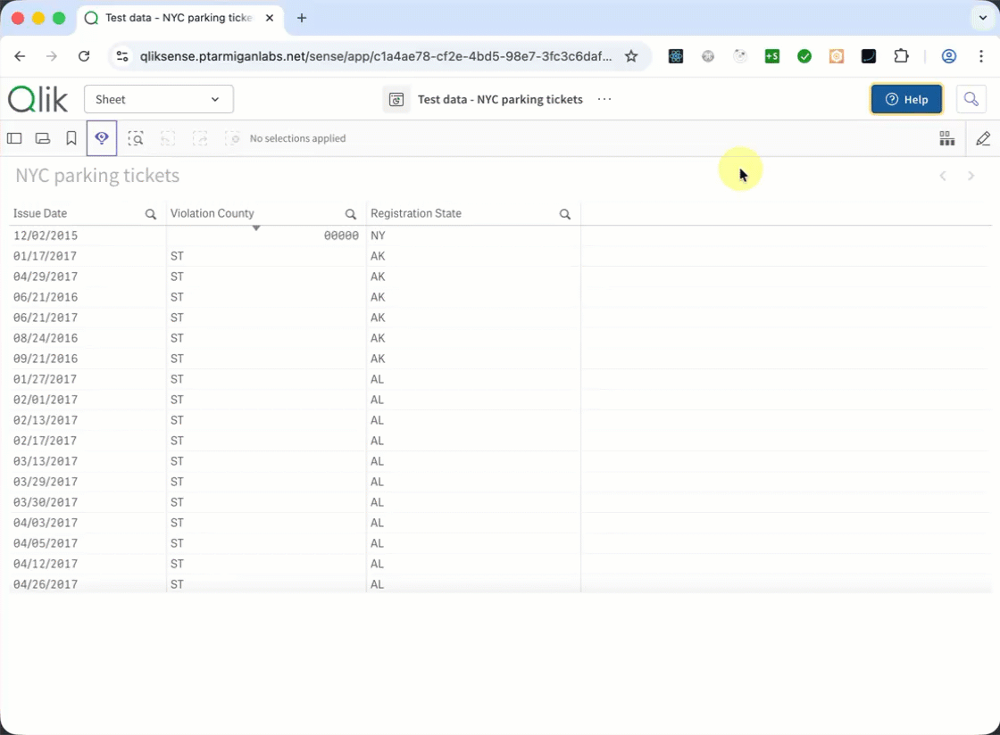
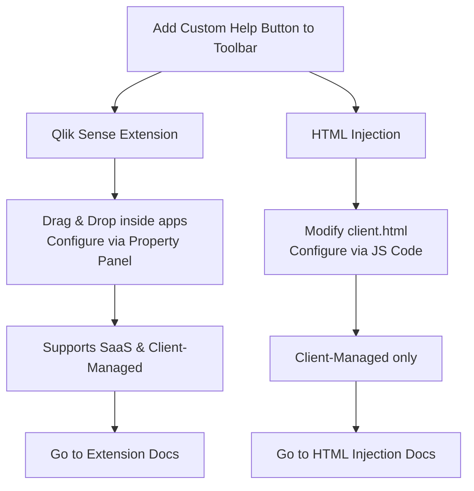

# Qlik Sense Help Button

This repository provides different solutions for adding a customized help button into the Qlik Sense application toolbar. The help button gives users quick access to context-aware support resources, documentation, or bug reporting tools directly within the Qlik Sense interface.



Qlik's native help button takes the user to Qlik's online help resources. This is great, but may not be ideal for organizations that want to provide their own custom documentation, corporate wikis, or specific support links. This project provides multiple ways to create a more tailored help and user feedback experience.

## Two Installation Methods

You can choose between two different approaches for adding the help button to your Qlik Sense environment, depending on your needs and whether you use Qlik Sense SaaS (Cloud) or Client-Managed. Both approaches yield the same end result.



### 1. Qlik Sense Extension (Recommended)

* **[Extension Documentation](./extension/README.md)**
* A native Qlik Sense extension built using modern Nebula.js hooks.
* Works on **both Qlik Sense SaaS (Cloud)** and **Client-Managed Qlik Sense (Enterprise)**.
* Easily configured by developers from within the Qlik Sense Property Panel (custom colors, icons, menus).
* To use, simply drop the extension on a sheet, and it will dynamically inject the button into the global toolbar when the user switches to Analysis mode.

### 2. HTML Injection (Client-Managed only)

This method injects vanilla JavaScript directly into your `client.html` file on the Qlik Sense Enterprise on Windows server. It requires zero dependencies and is extremely lightweight, making it ideal for simple, server-wide setups where minimizing complexity is key. The help button will be added to the toolbar of *every app for all users*, and can be configured via JavaScript code.

Current available variants for HTML injection variant:

* **[Basic](./variants/basic/README.md)**
  * The standard vanilla JavaScript implementation.
* **[Bug Report](./variants/bug-report/README.md)**
  * Everything in Basic, plus a built-in **Bug Report** dialog.
  * Clicking "Report a bug" opens a modal pre-populated with Qlik Sense context (user ID, name, Sense version, app ID, sheet ID, URL).
  * The user adds a free-text description and submits — the report is POSTed as JSON to a configurable webhook endpoint.

## Shared Features

### Template Fields (Context-Aware Links)

Both the Qlik Sense extension and the HTML variants support **template fields** — dynamic `{{…}}` placeholders in URLs that are resolved at click time using live Qlik Sense context. This enables context-sensitive help, directing users to app-specific or sheet-specific documentation pages.

Supported fields: `{{userDirectory}}`, `{{userId}}`, `{{appId}}`, `{{sheetId}}`.

Example Configuration:

```js
menuItems: [
  {
    label: 'Help for this app',
    url: 'https://wiki.example.com/qlik/apps/{{appId}}',
    icon: 'help',
    target: '_blank',
  },
]
```

See [docs/template-fields.md](./docs/template-fields.md) for full documentation including all supported fields, fallback behaviour, and configuration examples.

### Multi-Language Support

Both methods support localized interfaces so you can provide menus built for your user's language:

* **The Extension** typically has its own property panel localization.
* **HTML Variants** ship with self-contained language folders (**English** `en`, **Swedish** `sv`, **Norwegian** `no`, **Danish** `da`, **Finnish** `fi`, **German** `de`, **French** `fr`, **Polish** `pl`, **Spanish** `es`). Pick the folder that fits your organization and drop it in.

> **A note on folder names (HTML Variants):** Language folders are named using [ISO 639-1](https://en.wikipedia.org/wiki/List_of_ISO_639-1_codes) **language** codes, not [ISO 3166-1](https://en.wikipedia.org/wiki/ISO_3166-1_alpha-2) **country** codes. For example, Danish is `da` (not `dk`), Swedish is `sv` (not `se`), and German is `de` (not the country-code for Germany, which is also `de` by coincidence).

### Demo Server (Bug Report Webhook)

Both the extension and the HTML Bug Report variant can submit reports to a configurable webhook endpoint. A ready-to-use **Express.js demo server** is included for local testing and development — see the [Demo Server documentation](./shared/demo-server/README.md).

The demo server supports both HTTP and HTTPS, logs incoming bug reports to the console, and includes step-by-step instructions for generating self-signed certificates (required when testing with Qlik Sense Enterprise on Windows).

## License

This project is licensed under the MIT License - see the [LICENSE](LICENSE) file for details.
