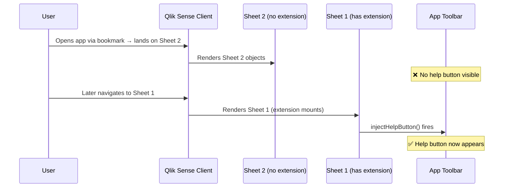
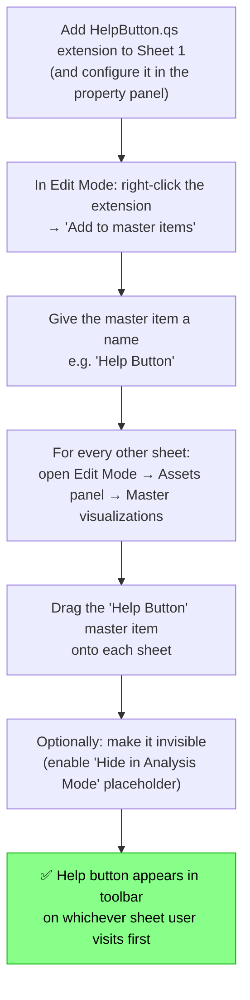
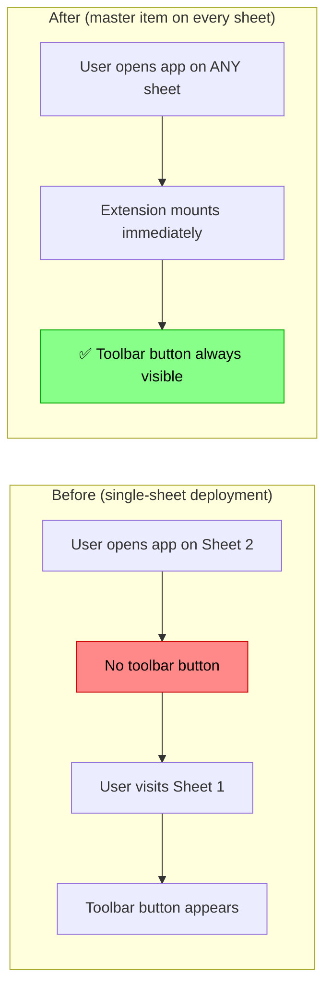

# Discussion draft — "Show & Tell" post

> **Instructions:** This file contains the full content for a GitHub Discussions "Show & Tell" post.
> Copy the content below the horizontal rule into a new discussion at:
> https://github.com/ptarmiganlabs/help-button.qs/discussions/new?category=show-and-tell

---

# 💡 Workaround: Make the Help Button visible on every sheet using a Master Item

_Relates to: [Issue #71 — HelpButton.qs does not appear until the host sheet is visited](https://github.com/ptarmiganlabs/help-button.qs/issues/71) and [PR #73 — Investigation of help button visibility on non-host sheets](https://github.com/ptarmiganlabs/help-button.qs/pull/73)_

---

## The Problem

When the **HelpButton.qs extension** is added to a Qlik Sense app, it is placed on a specific sheet (say _Sheet 1_). The extension injects a help button into the application's global toolbar when the user visits that sheet.

But here's the catch: **if a user opens the app directly on a different sheet** (via a bookmark, a URL, or because another sheet is set as the default), the help button never appears — until the user happens to navigate to the sheet containing the extension.

> **Why does this happen?** The extension uses the nebula.js Supernova lifecycle, which is _object-scoped_ — the code that injects the toolbar button only runs when the sheet containing the extension object is actually rendered by the Qlik Sense client. There is no app-level hook available in the Supernova API.

---

## The Workaround: Master Items

Qlik Sense's **Master Items** feature lets you define a reusable visualization object once and then reference it on as many sheets as you need. Creating a Master Item from the HelpButton.qs extension and placing it on every sheet means the extension component will always be mounted, regardless of which sheet the user lands on first.

### How to Set It Up

**Step-by-step:**

1. **Configure the extension first.** Add HelpButton.qs to a sheet and set up all your menu items, colors, and labels through the property panel. Get it looking exactly right.

2. **Create a Master Item from it.** In Edit Mode, right-click the extension object and choose **Add to master items**. Give it a name like _Help Button_.

3. **Add the master item to every other sheet.** On each sheet (in Edit Mode), open the **Assets** panel on the left → **Master visualizations** → drag the _Help Button_ master item onto the sheet.

4. **Minimise its footprint (optional but recommended).** HelpButton.qs already has a built-in **"Show analysis placeholder"** toggle in the property panel. Disable it so the extension cell is invisible in Analysis Mode — end users will only see the toolbar button, not an empty cell on every sheet.

5. **Arrange it out of the way.** Place the master item in a corner of the sheet grid and resize it to 1×1 cells. Even hidden, the extension's grid cell exists and is what triggers the toolbar injection.

### What Changes for End Users?

The user experience becomes consistent: **the help button appears in the toolbar on whichever sheet the user opens first**, with no need to visit a specific sheet.

---

## Caveats

| Consideration | Detail |
|---|---|
| **New sheets** | When a new sheet is added to the app, the master item must be added to it manually. This is the main operational overhead of this approach. |
| **Config changes** | Changing the master item's config (colors, links, etc.) in one place updates it on all sheets — that's the power of master items. |
| **Edit mode** | In Edit Mode, the extension shows its placeholder widget on every sheet. This is expected and intentional. |
| **Performance** | Each sheet now mounts the extension component, but since the toolbar button is a singleton (guarded by `CONTAINER_ID`), only one actual injection happens. The overhead is negligible. |
| **Sense version** | Master Items for extensions work on both **Qlik Sense Client-Managed** (Enterprise on Windows) and **Qlik Cloud**. |

---

## Looking Ahead

A longer-term code solution is being investigated in [PR #73](https://github.com/ptarmiganlabs/help-button.qs/pull/73). The current leading option is to use `sessionStorage` to cache the extension's configuration at first mount, then restore it automatically on subsequent sheet navigations — eliminating the cold-start problem entirely without requiring master items.

In the meantime, the master item workaround is the most reliable way to ensure a consistent experience for all users.
