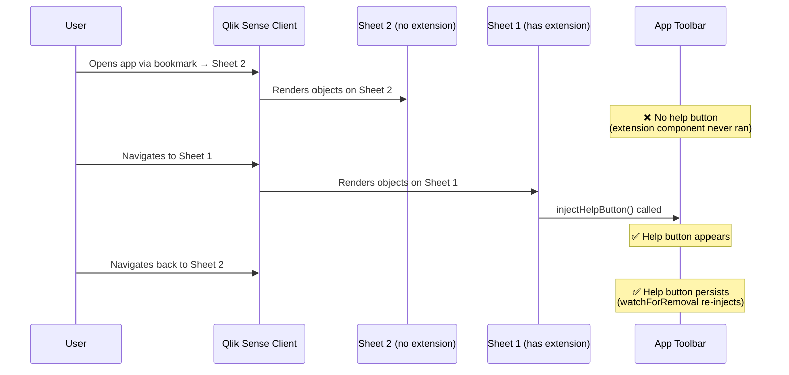
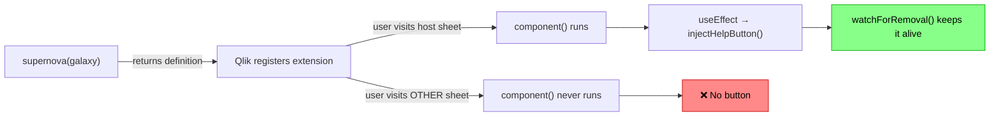
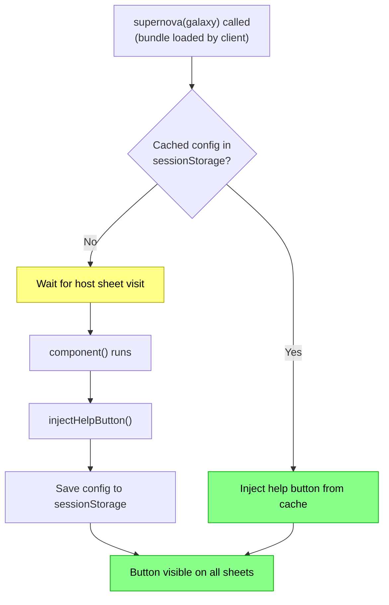
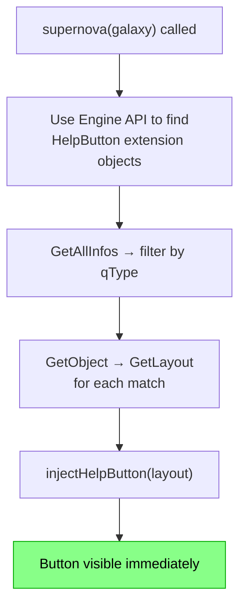
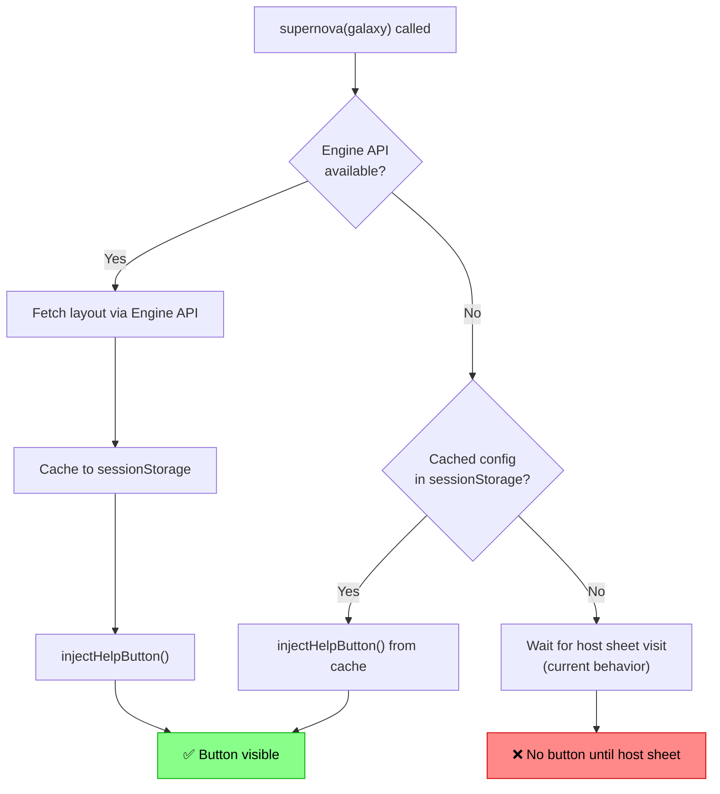
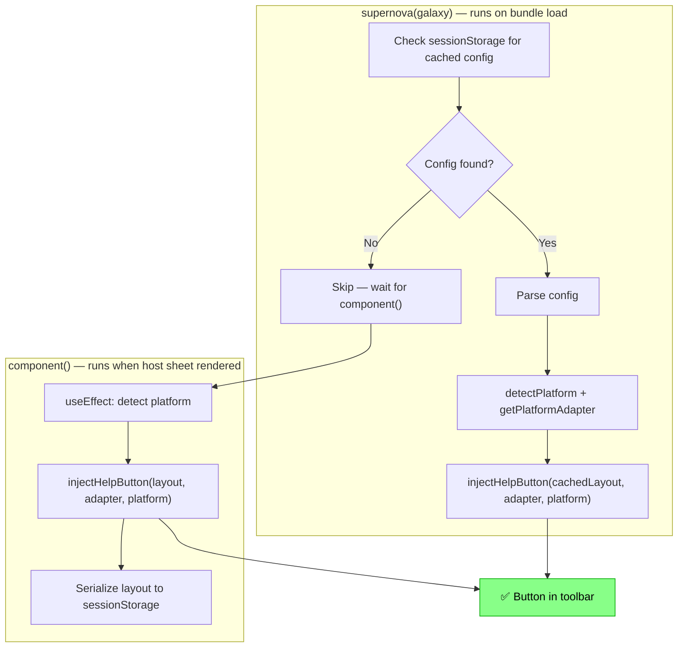

# Investigation: Help Button Not Visible Until Host Sheet Is Visited

> **Issue:** [HelpButton.qs does not appear until sheet containing the extension object has been visited](https://github.com/ptarmiganlabs/help-button.qs/issues/71)
>
> **Scope:** Extension variant only (not HTML injection variants).

## Problem Summary

The HelpButton.qs extension uses the **nebula.js Supernova** lifecycle. Its `component()` function — which injects the help button into the Qlik Sense toolbar — only executes when Qlik Sense **renders** the extension object. Since the extension lives on a specific sheet, the button will not appear until the user navigates to that sheet at least once.

If a user opens the app via a bookmark or URL that targets a different sheet, the help button is completely absent until the host sheet is visited.

## Root Cause

The Supernova extension lifecycle is **object-scoped, not app-scoped**:

1. `supernova(galaxy)` is called once when the extension bundle is loaded by the client — but this only returns a definition object; no rendering or DOM work happens here.
2. `component()` is called each time the extension's containing sheet is rendered.
3. The `useEffect` hook inside `component()` is responsible for calling `injectHelpButton()`.
4. `watchForRemoval()` handles SPA navigation **after** the first injection, but it cannot bootstrap from nothing — it needs `lastConfig` to be set by a prior `injectHelpButton()` call.

## Constraints

Any solution must work within these constraints:

| Constraint | Detail |
|---|---|
| **Cross-platform** | Must work on both Qlik Sense Client-Managed (Enterprise on Windows) and Qlik Cloud |
| **No external dependencies** | The extension is vanilla JS bundled via Rollup (nebula CLI). No runtime library additions. |
| **Single extension package** | Users should not need to install a second extension or helper script. |
| **Configuration via property panel** | The extension's appearance and behavior are configured in the Qlik Sense property panel and stored as object properties. Any solution must use these configured properties. |
| **Nebula.js Supernova API** | The extension uses the modern Supernova API — not the legacy `paint()`/`define()` API. |

## Solution Options

### Option A: Cache Config to `sessionStorage` + Bootstrap on Bundle Load

**Concept:** When `component()` first runs, persist the full extension layout to `sessionStorage`. Add startup logic in the `supernova()` factory function (which runs when the bundle is loaded by any sheet) that checks for a cached config and injects the button immediately.

**How it works:**

1. When `component()` runs in analysis mode, serialize the relevant layout properties (button style, menu items, popup config, etc.) and write them to `sessionStorage` with an app-specific key (e.g., `hbqs-config-{appId}`).
2. In the `supernova()` function body (which runs on bundle load), check `sessionStorage` for a cached config. If found, call `injectHelpButton()` immediately.
3. When `component()` later runs on the host sheet, it updates the cache and re-injects with the latest config.

**Advantages:**
- Works on both Cloud and Client-Managed.
- No additional API calls to the Engine.
- Session-scoped — clears when the browser tab closes, so stale configs don't persist indefinitely.
- Very low latency — the button appears almost instantly on cached loads.

**Disadvantages:**
- **Cold start problem**: The very first time a user opens the app (or after clearing browser data), the button won't appear until the host sheet is visited. Subsequent visits to the app in the same session (or a new tab) will work from cache.
- Config staleness: If the developer changes the config, users with cached data will see old config until they visit the host sheet. However, since `sessionStorage` is per-tab and short-lived, this risk is low.
- Storage limitations: `sessionStorage` is limited (~5 MB), but the config is small (a few KB).

**Complexity:** Low — requires adding serialization/deserialization logic and a bootstrap check in `supernova()`.

---

### Option B: Use `localStorage` for Persistent Cache (Variant of Option A)

Same as Option A, but uses `localStorage` instead of `sessionStorage`.

**Additional advantages:**
- The cached config survives browser restarts, so even the second app visit will show the button immediately.

**Additional disadvantages:**
- Higher staleness risk: If config changes, users may see the old button until they visit the host sheet.
- Requires cache invalidation strategy (e.g., store a version or timestamp alongside the config).
- Persists across all tabs, which could cause issues in multi-app scenarios if keys aren't scoped properly.

**Complexity:** Low — same as Option A with a different storage backend.

---

### Option C: Query the Engine API at Bundle Load

**Concept:** When `supernova(galaxy)` is called, use the Qlik Engine API (via `enigma.js` or the Capability APIs) to find the HelpButton extension object and fetch its layout, regardless of which sheet is active.

**How it works:**

1. Inside `supernova(galaxy)`, access the Engine session. On Client-Managed, this could be via `require(['qlik'], ...)` using the Capability API. On Cloud, the available APIs differ.
2. Call `GetAllInfos` to enumerate all objects, filtering for `qType === 'helpbutton-qs'`.
3. For each matching object, call `GetObject` + `GetLayout` to retrieve the full layout.
4. Use that layout to call `injectHelpButton()`.

**Advantages:**
- No cold-start problem — works on the very first app visit.
- Always uses the latest config from the Engine.
- No browser storage needed.

**Disadvantages:**
- **Complex cross-platform implementation:** The `galaxy` object does not expose the app/engine reference directly. Getting it requires different approaches on Cloud vs Client-Managed.
  - **Client-Managed:** Can use `require(['qlik'], ...)` (RequireJS Capability API) — but this is the **legacy API** and mixing it with nebula.js is not officially supported.
  - **Cloud:** No direct access to Capability APIs. Would need to establish an enigma.js session or intercept the existing one.
- Extra network request(s) at app startup — may add latency.
- The `supernova()` factory function is synchronous (returns a definition object). The Engine API calls are async. This means the injection would happen asynchronously, and there's a timing gap.
- Fragile: Relies on internal Qlik APIs and Engine session availability at bundle-load time.

**Complexity:** High — significantly different implementations for Cloud vs Client-Managed, and requires careful timing.

---

### Option D: Hybrid — Engine API with `sessionStorage` Fallback

**Concept:** Attempt the Engine API approach (Option C) first. If it succeeds, cache the result to `sessionStorage`. If it fails (e.g., Engine not ready yet), fall back to the cached config (Option A/B).

**Advantages:**
- Best of both worlds: immediate injection when possible, cache fallback otherwise.
- Degrades gracefully to current behavior if both paths fail.

**Disadvantages:**
- Most complex implementation — combines the challenges of Options A and C.
- Still has the Client-Managed vs Cloud API divergence problem.

**Complexity:** Very high.

---

### Option E: Place Extension on a Master Item / Hidden Container

**Concept:** This is a **deployment workaround**, not a code change. The administrator places the HelpButton extension inside a container or master item that is present on every sheet (or on a "template" sheet that Qlik clones).

**Advantages:**
- No code changes needed.
- Works today.

**Disadvantages:**
- Requires manual effort from the deploying admin.
- Must remember to add the extension to every new sheet.
- Not scalable for apps with many sheets.
- Doesn't solve the fundamental problem — just works around it.

**Complexity:** None (code-wise), but increases deployment burden.

---

### Option F: Companion HTML Snippet (Hybrid Deployment)

**Concept:** On Client-Managed Qlik Sense, the admin deploys a minimal companion script (similar to the existing HTML injection variants) to `client.html`. This script runs on every page load and provides the button independently. The extension still provides the property panel for configuration.

**How it works:**

1. The extension's `component()` saves its config to `localStorage` (keyed by app ID).
2. A small companion script in `client.html` reads `localStorage` and injects the help button on every page load.
3. When the extension renders, it takes over from the companion script with fresh config.

**Advantages:**
- Guarantees the button is always present on Client-Managed.
- Leverages existing HTML injection variant code.

**Disadvantages:**
- **Does not work on Qlik Cloud** — there is no `client.html` to modify.
- Requires a two-step deployment (extension + script).
- Couples the extension to the HTML variant's lifecycle.

**Complexity:** Medium — requires maintaining two deployment artifacts.

---

## Comparison Matrix

| Criterion | A: sessionStorage | B: localStorage | C: Engine API | D: Hybrid | E: Deploy workaround | F: Companion script |
|---|---|---|---|---|---|---|
| **First-visit coverage** | ❌ Needs one host-sheet visit | ❌ Needs one host-sheet visit (then persists) | ✅ Always works | ✅/❌ Depends on Engine availability | ✅ If set up correctly | ✅ CM only |
| **Subsequent visits** | ✅ Same session | ✅ Always | ✅ Always | ✅ Always | ✅ If maintained | ✅ CM only |
| **Cloud support** | ✅ | ✅ | ⚠️ Complex | ⚠️ Complex | ✅ | ❌ |
| **Client-Managed support** | ✅ | ✅ | ⚠️ Complex | ⚠️ Complex | ✅ | ✅ |
| **Config freshness** | ⚠️ Until host sheet visited | ⚠️ Until host sheet visited | ✅ Always fresh | ✅ Mostly fresh | ✅ Fresh | ⚠️ Depends on localStorage |
| **Implementation complexity** | 🟢 Low | 🟢 Low | 🔴 High | 🔴 Very high | 🟢 None | 🟡 Medium |
| **Maintenance burden** | 🟢 Low | 🟢 Low | 🟡 Medium | 🔴 High | 🔴 Ongoing (per-app) | 🟡 Two artifacts |
| **User experience** | 🟡 Cold-start gap | 🟢 Gap only on first-ever visit | 🟢 Seamless | 🟢 Seamless | 🟢 Seamless | 🟢 Seamless (CM) |

## Recommendation

**Option A (`sessionStorage` cache + bootstrap)** is the recommended starting point. It offers:

1. **Low implementation complexity** — a small, self-contained change in the existing codebase.
2. **Cross-platform compatibility** — works identically on Cloud and Client-Managed.
3. **Acceptable UX trade-off** — the cold-start gap (first visit per session) is a minor limitation that most users will not notice, since they typically visit the host sheet during normal usage.
4. **Clean fallback** — if the cache is missing, the behavior degrades to the current (known) behavior.

If the cold-start gap is unacceptable, **Option B (`localStorage`)** eliminates it after the first-ever session. A TTL-based invalidation strategy (e.g., cache expires after 24 hours) would mitigate staleness concerns.

**Option C (Engine API)** should only be pursued if zero cold-start gap is a hard requirement and the team is willing to invest in platform-specific implementations and ongoing maintenance as Qlik APIs evolve.

## Implementation Sketch for Option A

### Key implementation details:

1. **Cache key:** `hbqs-config-{appId}` — scoped per app to support multi-app scenarios.
2. **App ID extraction:** Parse from `window.location.pathname` (both Cloud and CM URL structures contain the app GUID).
3. **Serialized data:** Only the layout properties needed by `injectHelpButton()` — button style, popup style, menu items, labels, icons. Not the full Qlik layout object.
4. **Bootstrap timing:** The `supernova()` factory is called synchronously, but platform detection is async. The bootstrap should run the async detection and injection in a fire-and-forget manner (similar to how `component()` already does it).
5. **Guard against double injection:** The existing `CONTAINER_ID` check in `injectHelpButton()` already prevents double injection. When `component()` later runs, it will call `destroyHelpButton()` + `injectHelpButton()` with fresh config, seamlessly replacing the cached version.

## Open Questions

1. **Should the cache include a version/hash?** If the extension is upgraded, old cached configs could cause UI mismatches. A simple version check (compare `PACKAGE_VERSION` in cache vs runtime) would handle this.
2. **Should we support `localStorage` as an opt-in setting?** Some users may prefer persistent caching. This could be exposed as an advanced property-panel toggle.
3. **What about edit-mode interactions?** The current code calls `destroyHelpButton({ clearConfig: true })` when entering edit mode. The bootstrap cache should also be cleared when this happens, to avoid re-injecting a button during editing.
4. **Multi-instance apps:** If an app has multiple HelpButton extension objects on different sheets (unusual but possible), which config wins? The last-written-to-cache config would be used. This seems acceptable for a singleton button.
