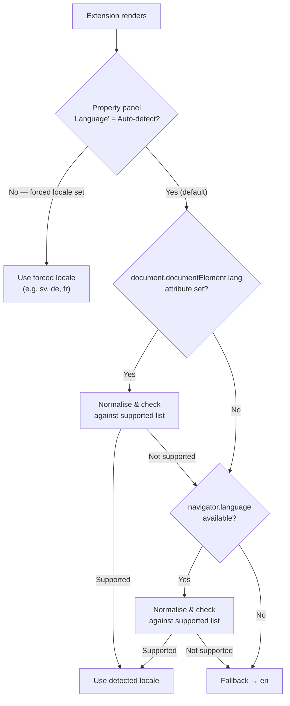
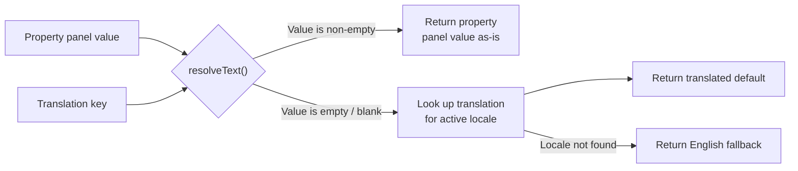
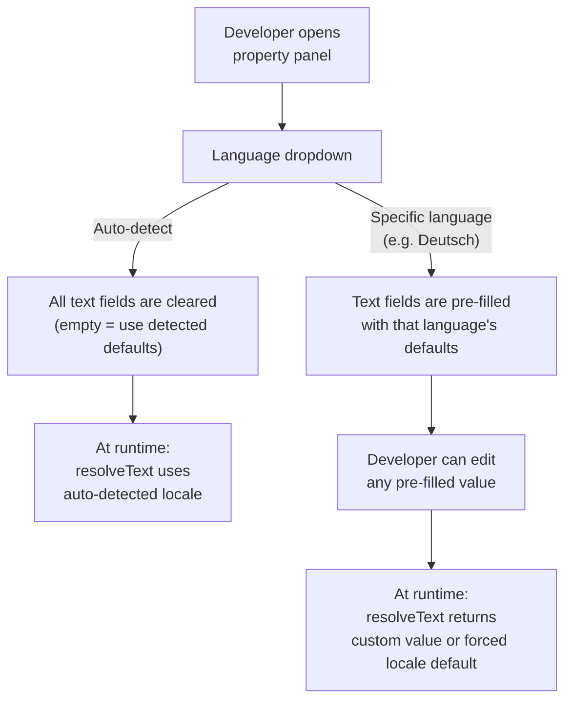
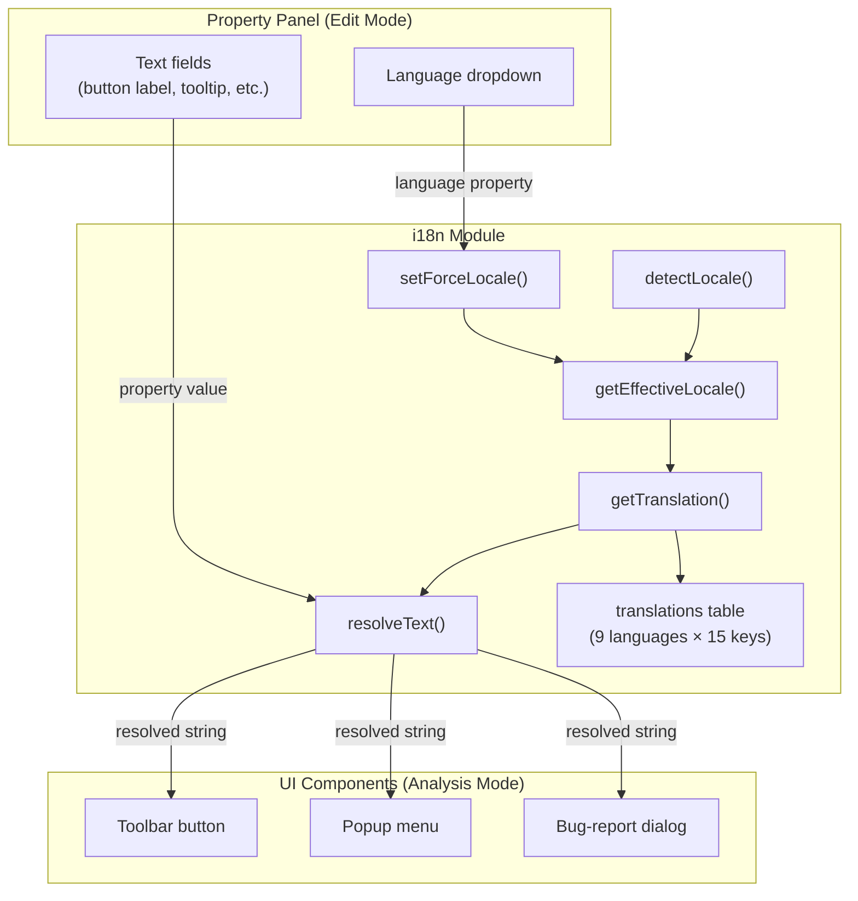
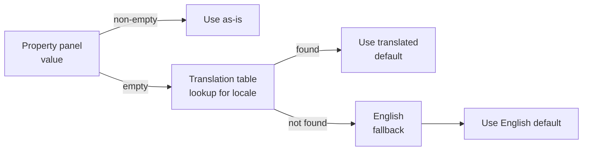

# Multi-Language Support

The HelpButton.qs **extension** automatically translates its UI strings to match the language of the Qlik Sense client. This page explains how the translation system works, what "defaults" mean, and how you as an app developer can customise the behaviour.

> **Scope:** This document covers the **extension variant** only (the `.qext` package installed via the Management Console). The HTML-injection variants have a different localisation model and are not covered here.

---

## Supported Languages

The extension ships with built-in translations for **9 languages**:

| Code | Language | Native Name |
|------|----------|-------------|
| `en` | English | English |
| `sv` | Swedish | Svenska |
| `no` | Norwegian | Norsk |
| `da` | Danish | Dansk |
| `fi` | Finnish | Suomi |
| `de` | German | Deutsch |
| `fr` | French | Français |
| `pl` | Polish | Polski |
| `es` | Spanish | Español |

English (`en`) is the **ultimate fallback** — if the detected or forced locale is not supported, all strings resolve to their English value.

---

## What Are "Defaults"?

Every visible text string in the extension — the toolbar button label, its tooltip, the popup title, and all bug-report dialog texts — has a **built-in default value** for each supported language. These defaults are stored inside the extension bundle in a translations table.

When you add the extension to a sheet and leave the text fields in the property panel **empty**, the extension does not show blank text. Instead it automatically fills in the correct default for the active language. This is what "default" means in the context of HelpButton translations: **the pre-packaged translated string that is used when the developer has not typed a custom value.**

### Translated strings

The following UI elements have built-in defaults for all 9 languages:

| UI Element | Translation Key | English Default |
|---|---|---|
| Toolbar button label | `buttonLabel` | Help |
| Toolbar button tooltip | `buttonTooltip` | Open help menu |
| Popup title | `popupTitle` | Need assistance? |
| Bug-report dialog title | `bugReportTitle` | Report a Bug |
| Description field label | `bugReportDescriptionLabel` | Description |
| Description placeholder | `bugReportDescriptionPlaceholder` | Describe the issue you encountered… |
| Submit button | `bugReportSubmit` | Submit |
| Cancel button | `bugReportCancel` | Cancel |
| Success toast | `bugReportSuccessMessage` | Bug report submitted successfully! |
| Error toast | `bugReportErrorMessage` | Failed to submit bug report. Please try again. |
| Context header | `bugReportContextHeader` | Context (auto-collected) |
| Loading message | `bugReportLoadingMessage` | Gathering environment info… |
| Edit-mode placeholder title | `editPlaceholderTitle` | HelpButton.qs |
| Edit-mode placeholder description | `editPlaceholderDescription` | Injects a help button into the toolbar. Configure menu items in the property panel. |
| Analysis-mode placeholder | `analysisPlaceholder` | Help button active in toolbar |

---

## How Language Detection Works

When the extension loads, it determines which language to use through a priority chain. The first source that yields a supported locale wins.

### Norwegian special case

Norwegian Bokmål (`nb`) and Nynorsk (`nn`) are both normalised to `no` automatically. A Qlik Sense client set to `nb-NO` will resolve to the `no` translations.

---

## How Text Resolution Works

The core of the translation system is the **`resolveText`** function. Every time the extension needs to display a translatable string, it calls `resolveText` with two inputs:

1. **The property-panel value** — whatever the developer typed (or left empty) in the property panel.
2. **The translation key** — an identifier that maps to the built-in translations table.

**In plain language:** Property-panel values always win. If you type a custom string, it is used exactly as-is regardless of the language setting. If you leave the field empty, the extension fills in the built-in default for the current language.

### Example

A developer in Sweden opens Qlik Sense (UI language = Swedish). They add the extension and leave the **Button label** field empty.

| Step | What happens |
|---|---|
| 1 | Extension detects locale → `sv` |
| 2 | `resolveText('', 'buttonLabel')` is called |
| 3 | Property-panel value is empty → fall through to translation lookup |
| 4 | `translations.buttonLabel.sv` → `'Hjälp'` |
| 5 | The toolbar button displays **Hjälp** |

If the same developer types `Support` into the Button label field, `resolveText('Support', 'buttonLabel')` returns `'Support'` immediately — the translation table is never consulted.

---

## The Language Dropdown

In the property panel, the **Language** section contains a dropdown with two kinds of options:

| Option | Behaviour |
|---|---|
| **Auto-detect** (default) | The extension detects the Qlik UI language at runtime and uses the matching translations. |
| **A specific language** (e.g. Svenska, Deutsch) | Forces all translated strings to that language, regardless of the end-user's browser or Qlik UI language. |

### What happens when you change the dropdown

| From → To | Effect |
|---|---|
| Auto-detect → Specific language | A confirmation prompt appears. If accepted, all translatable fields (button label, tooltip, popup title, bug-report dialog title) are **overwritten** with the standard translations for that language. You can then edit any of them. |
| Specific language → Auto-detect | A confirmation prompt appears. If accepted, all translatable fields are **cleared** (set to empty). This means the extension will auto-detect the language at runtime and use the built-in defaults. |
| Specific language → Another language | Same as the first case — fields are overwritten with the new language's defaults. |

> **Tip:** Switching to a specific language and back to Auto-detect is a quick way to reset all text fields to their defaults.

---

## Architecture Overview

The diagram below shows how the main components fit together at a high level.

---

## Common Scenarios

### Scenario 1 — Fully automatic (recommended)

Leave the Language dropdown on **Auto-detect** and all text fields **empty**. The extension will display the correct language for each end-user based on their Qlik Sense UI language.

- A user with Qlik set to Swedish sees "Hjälp"
- A user with Qlik set to German sees "Hilfe"
- A user with an unsupported language sees English ("Help")

This is the **zero-configuration** default and works well in multi-language organisations.

### Scenario 2 — Force a single language for all users

Select a specific language in the dropdown (e.g. **Français**). The extension pre-fills all text fields with the French defaults. All end-users see the extension in French, regardless of their own Qlik UI language.

### Scenario 3 — Force a language, then customise individual strings

Select a language to pre-fill the defaults, then edit specific fields. For example, select **Deutsch** and then change the popup title from "Brauchen Sie Hilfe?" to "Wie können wir helfen?". The customised string is stored in the property panel and will always be used; the remaining fields continue to use the German defaults.

### Scenario 4 — Auto-detect with custom overrides

Leave the dropdown on **Auto-detect** but type a custom value in one or more text fields. The custom values are used as-is (for all users, in all languages), while the remaining empty fields continue to auto-translate.

> **Note:** Custom text values are language-agnostic — they are shown to all users regardless of locale. If you need different custom text per language, use Scenario 2 or Scenario 3 instead.

---

## Fallback Chain Summary

| Priority | Source | When used |
|---|---|---|
| 1 | Property-panel value | Developer typed a custom string |
| 2 | Translation for active locale | Field is empty and locale has a translation |
| 3 | English (`en`) translation | Field is empty and locale is unsupported |
