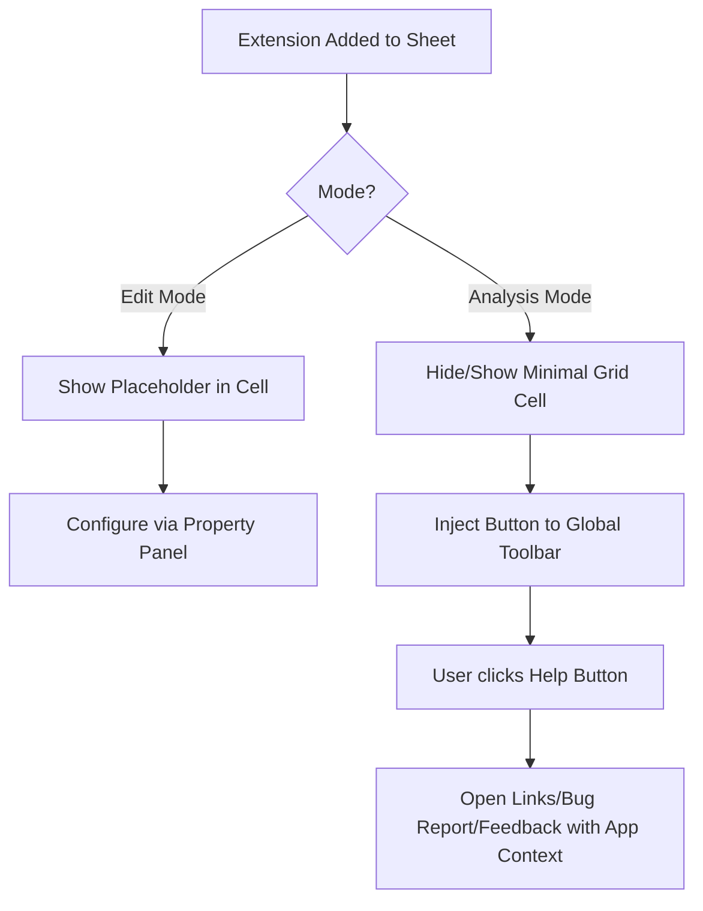
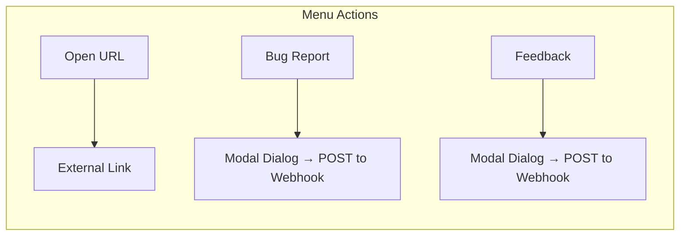

# helpbutton.qs

**helpbutton.qs** is a Qlik Sense extension that injects a configurable help button directly into the Sensse application's toolbar. It provides a seamless way for end-users to access documentation, support resources, or bug reporting forms without cluttering the app sheet area.

## Features

- **Global Toolbar Integration**: In analysis mode, the extension attaches a help button to the main Qlik Sense native toolbar, rather than rendering inside a grid cell.
- **Cross-Platform Support**: Automatically detects and works on both **Qlik Sense SaaS (Cloud)** and **Client-Managed Qlik Sense (Enterprise)** environments, with same features on both platforms.
- **Invisible Footprint**: The extension cell itself can be configured to be invisible to end-users on the sheet, suppressing default interactive grid cell menus and hover menus.
- **Extensive Customization**: Configure colors, icons, languages, and menu actions directly from the Qlik Sense property panel.
- **Theme Presets**: Apply one of four predefined color palettes (Default, Lean Green, Corporate Blue, Corporate Gold) to instantly style the toolbar button, popup, and menu items to your corporate brand.
- **Context-Aware Links**: Dynamically pass application context (such as App ID, Sheet ID, and user details) to outbound links using template tags.
- **Built-in Translations**: Supports automatic UI translation into multiple languages based on Qlik Sense locale, with full override capabilities via an expandable "Language & Translations" section in the property panel (see [language & translations docs](docs/language-and-translations.md) for details).

## Audience

This extension is designed to be added by **Qlik Sense Administrators and Developers** into their Sense applications. Once added to a sheet, it provides a globally accessible help menu for the end-users of that application.

## How It Works

When you drag and drop the extension onto a sheet:

1. In **Edit Mode**: It displays a placeholder within the grid cell indicating the current active features (e.g. `4 menu items · Bug report: On · Feedback: On` where "On" implies at least one active menu item is configured with that corresponding action type). The help button itself also remains visible down in the grid cell, allowing developers to immediately test menu items while configuring them via the standard Qlik Sense Property Panel.
2. In **Analysis Mode**: The extension dynamically removes itself from the sheet's visual flow and injects the actual button into the top application toolbar.



## Installation

1. Download the latest compiled extension `.zip` file from the releases page (or build it from source). Unzip that file to get the `helpbutton-qs.zip` package, which is the actual extension to be imported into Qlik Sense.
2. **Qlik Sense SaaS**: Upload the extension in the Management Console under **Extensions**.
3. **Qlik Sense Client-Managed**: Import the zip file via the Qlik Management Console (QMC) under the **Extensions** section.

## Usage

1. Open your Qlik Sense application in Edit Mode.
2. Drag the **HelpButton.qs** extension from the **.qs Library** bundle inside the Custom Objects panel onto your sheet.
3. Configure the appearance, links, and behavior in the Property Panel on the right.
4. Switch to Analysis Mode to see the button appear in the top toolbar.

## Menu Item Types

When configuring the **Menu Items** in the Property Panel, you can add multiple options that map to different actions. The help button supports three types of menu actions:

1. **Outbound Link (`link`)**: 
   - Opens a specified URL (can be configured to open in a new tab or the same window).
   - Useful for pointing users to external documentation, intranet pages, wikis, or company portals.
   - Supports [template fields](../docs/template-fields.md) in the URL (e.g. `https://help.example.com/sys/{{appId}}`), allowing for context-sensitive deep links that adapt to the user's current app or sheet.
2. **Bug Report Dialog (`bugReport`)**: 
   - Opens an interactive modal directly inside Qlik Sense where users can write a detailed text description of an issue.
   - Automatically bundles the user's environment metadata into a JSON payload and POSTs it to a configured webhook endpoint via a background request. 
3. **Feedback Dialog (`feedback`)**:
   - Opens a modal dialog where users can rate the current app (1–5 stars) and/or leave a free-text comment.
   - Star rating and comment fields can each be independently enabled or disabled via the property panel.
   - When the comment field is enabled, a configurable maximum character length is enforced, with a live remaining-characters counter shown in the dialog.
   - Automatically gathers environment context (same fields as the bug report) and POSTs the feedback data as JSON to a configured webhook endpoint.



## Bug Report Context Fields

When the extension is configured to use the **Report a Bug** action, it will automatically gather and submit relevant context metadata about the user's environment alongside their bug description. 

You can configure exactly which fields are visible in the bug report dialog—and subsequently sent to your webhook—using the **"Context fields (comma-separated)"** setting in the property panel. 

The following fields are available:

| Field Name | Description | Example |
|---|---|---|
| `userName` | Full name of the authenticated user | `John Doe` |
| `userId` | User ID of the authenticated user | `johnd` (client-managed) / `johnd@example.com` (Cloud) |
| `userDirectory` | Directory of the authenticated user (client-managed only) | `CORP` |
| `tenantId` | Tenant ID of the user (Qlik Cloud only) | `tenantxyz` |
| `status` | Account status (Qlik Cloud only) | `active` |
| `picture` | URL to the user's avatar (Qlik Cloud only) | `https://s.gravatar.com/...` |
| `preferredZoneinfo` | User's preferred time zone (Qlik Cloud only) | `Europe/Stockholm` |
| `roles` | Comma-separated list of user roles (Qlik Cloud only) | `[AnalyticsAdmin], [SharedSpaceCreator]` |
| `appId` | GUID of the active Qlik Sense application | `df68e14d-...` |
| `sheetId` | ID of the active sheet | `850cffb0-...` |
| `urlPath` | Current URL path context of the browser | `/sense/app/.../sheet/...` |
| `senseVersion` | Qlik Sense product version (client-managed only) | `November 2023 (v14.187.4)` |
| `platform` | Auto-detected platform type | `client-managed` or `cloud` |
| `browser` | Browser user-agent string | `Mozilla/5.0...` |
| `timestamp` | Local time the report dialog was opened | `3/6/2026, 8:51:57 AM` |

## Feedback Context Fields

The **Feedback** dialog uses the same context fields as the bug report dialog. You can configure which fields to collect via the **"Context fields (comma-separated)"** setting under the Feedback Settings section in the property panel.

### Feedback Configuration

The feedback dialog supports these property panel settings:

| Setting | Type | Default | Description |
|---|---|---|---|
| Webhook URL | string | *(empty)* | POST endpoint to receive feedback data |
| Authentication | dropdown | `None` | Auth strategy (None / Authorization header / Sense session / Custom headers) |
| Show star rating | toggle | On | Whether to display a 1–5 star rating selector |
| Show free-text comment | toggle | On | Whether to display a comment textarea |
| Max comment length | number | `500` | Maximum characters allowed in the comment (shown as a live counter) |
| Context fields | string | `userName,appId,...` | Comma-separated list of context fields to collect |
| Dialog title | string | *(auto-translated)* | Custom dialog title (leave empty for auto-translation) |

### Feedback Payload

When the user submits feedback, it is POSTed as JSON to the configured webhook URL:

```json
{
  "timestamp": "2026-03-08T12:00:00.000Z",
  "context": {
    "userName": "John Doe",
    "appId": "df68e14d-...",
    "sheetId": "850cffb0-...",
    "urlPath": "/sense/app/.../sheet/.../state/analysis",
    "platform": "client-managed",
    "timestamp": "3/8/2026, 12:00:00 PM"
  },
  "rating": 4,
  "comment": "Great dashboards, very useful for daily reporting."
}
```

> **Note:** The `rating` field is only included when the star rating is enabled. The `comment` field is only included when the free-text comment is enabled. At least one of the two must be enabled and filled in for the user to submit.

### Cloud vs Client-Managed Availability

Not all context fields are available on every platform. The table below summarises what each field returns on **Qlik Cloud** and **Client-Managed** (Enterprise on Windows) deployments.

| Field | Client-Managed | Qlik Cloud |
|---|---|---|
| `userName` | ✅ User's full name from the Qlik Sense proxy API | ✅ User's display name from the Cloud `/api/v1/users/me` API |
| `userId` | ✅ Windows login name (e.g. `jsmith`) | ✅ User's email address (e.g. `jsmith@example.com`) |
| `userDirectory` | ✅ Active Directory / user directory (e.g. `CORP`) | ❌ Not applicable — shown as `(N/A)` |
| `tenantId` | ❌ Not applicable — shown as `(N/A)` | ✅ Included in the Cloud `/api/v1/users/me` API |
| `status` | ❌ Not applicable — shown as `(N/A)` | ✅ Included in the Cloud `/api/v1/users/me` API |
| `picture` | ❌ Not applicable — shown as `(N/A)` | ✅ Included in the Cloud `/api/v1/users/me` API |
| `preferredZoneinfo` | ❌ Not applicable — shown as `(N/A)` | ✅ Included in the Cloud `/api/v1/users/me` API |
| `roles` | ❌ Not applicable — shown as `(N/A)` | ✅ Included in the Cloud `/api/v1/users/me` API |
| `senseVersion` | ✅ Product version from `product-info.js` | ❌ Not available — shown as `(N/A)` |
| `appId` | ✅ Parsed from URL | ✅ Parsed from URL |
| `sheetId` | ✅ Parsed from URL | ✅ Parsed from URL |
| `urlPath` | ✅ Current browser URL path | ✅ Current browser URL path |
| `platform` | ✅ `client-managed` | ✅ `cloud` |
| `browser` | ✅ `navigator.userAgent` | ✅ `navigator.userAgent` |
| `timestamp` | ✅ Local date/time | ✅ Local date/time |

> **Tip:** For Qlik Cloud deployments you may want to remove `userDirectory` and `senseVersion` from the `collectFields` setting since they are not applicable. A recommended Cloud configuration would be:
> `userId,userName,appId,sheetId,urlPath,platform,browser,timestamp`

By default, the property panel has this pre-populated setting:
`userDirectory,userId,senseVersion,appId,sheetId,urlPath`

*Note: You can omit any fields you do not want to show or submit as part of the bug report layout by simply removing them from the comma-separated list.*

---

For technical documentation and development setup, please see the [developer documentation](docs/DEVELOPMENT.md).
