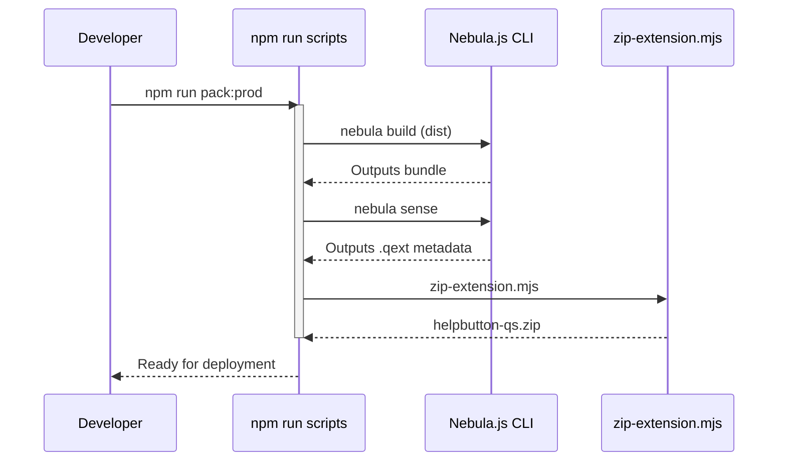

# helpbutton.qs Development Guide

This guide describes how the `helpbutton.qs` extension is built, tested, and distributed. The intended audience is developers who will be maintaining or extending the project.

## Project Structure

The extension uses  ES modules and is built around **Nebula.js**. It consists of several key architectural components:

- **Nebula Component Hooks (`src/index.js`)**: The standard functional entry point utilizing `useElement`, `useLayout`, `useOptions`, and `useEffect` to coordinate between edit and analysis mode workflows.
- **Platform Adaptation (`src/platform/`)**: Provides abstraction on top of Qlik Cloud and Qlik Sense Client-Managed versions, addressing differing DOM structures to integrate seamlessly onto the toolbar.
- **Toolbar Injector (`src/ui/toolbar-injector.js`)**: Escapes the standard container scope by binding directly to the Qlik application header.
- **Context Interceptor (`src/util/template-fields`)**: Intercepts app-specific context variables such as `{{appId}}` to create dynamic help links.
- **Property Panel (`src/ext.js`)**: Defines the configuration options visible in the Qlik Sense property panel.

## Common Scripts commands

Below is a breakdown of the available `npm run` commands:

### Development and Local Serve
| Command | Description |
| ---- | ---- |
| `npm run start` | Starts a local development server using `nebula serve`. |
| `npm run build` | Runs a development build using Nebula CLI (`nebula build`). Sets the `BUILD_TYPE` environment variable to `development` and disables source maps. |

### Build and Packaging
| Command | Description |
| ---- | ---- |
| `npm run build:dist` | Runs a production build (`nebula build`). |
| `npm run sense` | Generates the Qlik Sense metadata and the `.qext` file from `src` using `nebula sense`. |
| `npm run zip` | Executes `scripts/zip-extension.mjs`, which leverages the `archiver` dependency to package the compiled files into a deployable `.zip`. |
| `npm run post-build` | Post-processes the bundle files out of the Nebula hooks using `scripts/post-build.mjs`. |

### Recommended End-to-End Pack Commands
For creating a drop-in ready extension, these composite scripts bundle everything seamlessly:

* `npm run pack:dev`: Runs the full lifecycle in development mode (`build -> sense -> post-build -> zip`).
* `npm run pack:prod`: Runs the full lifecycle in production mode (`build:dist -> sense -> post-build -> zip`).

### Quality Control
| Command | Description |
| ---- | ---- |
| `npm run lint` / `npm run lint:fix` | Runs ESLint on `src` and `scripts` directories. |
| `npm run format` / `npm run format:check` | Runs Prettier to enforce code styling on all files. |

## Build Workflow

## Additional Technical Context

* **DOM Escape Mechanism:** Because the extension sits in the global header, it requires a robust DOM manipulation handler to attach itself without polluting ongoing React/Angular digest cycles in Qlik applications.
* **Singleton Lifecycle**: A `destroyHelpButton()` method in the cleanup effect tears down the toolbar listener when the user navigates away from the sheet or when the context object unmounts.
* **Menu Suppression:** The property panel provides configuration that utilizes JavaScript event interceptors and `MutationObserver` routines to effectively hide standard grid cell menus or Cloud React portals, leaving the item functionally invisible.