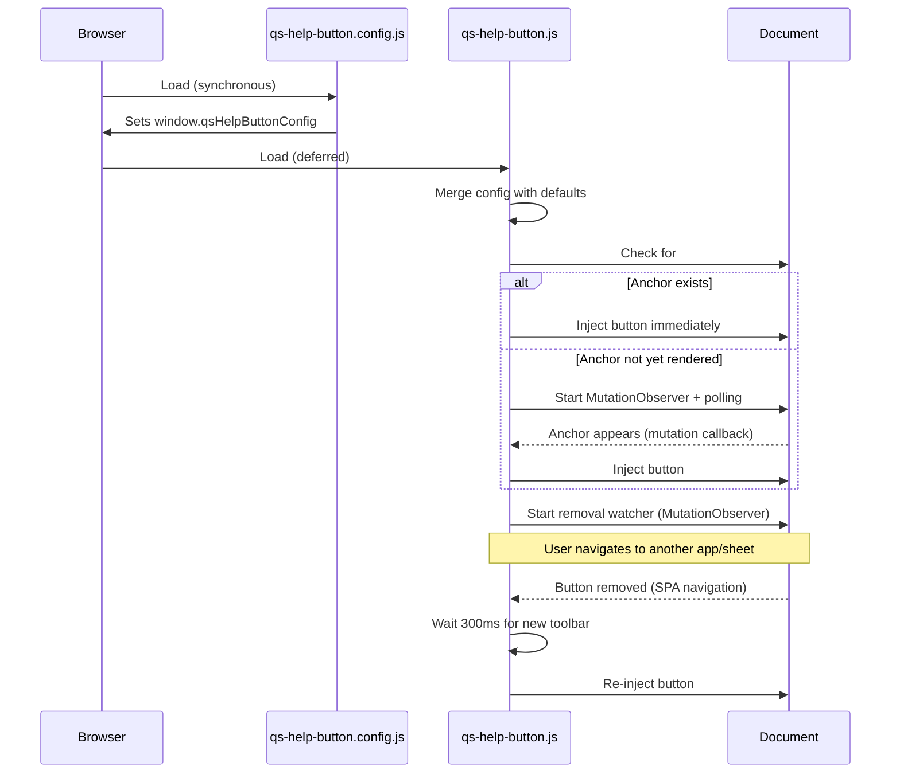

# qs-help-button — Basic Variant

A lightweight, self-contained solution that adds a **Help** button to the toolbar of every app in **Qlik Sense Enterprise on Windows** (client-managed).

Clicking the button opens a dropdown popup with configurable links — for example *Help documentation*,  *Report a bug* or a *link to any website*.


---

## Table of Contents

- [qs-help-button — Basic Variant](#qs-help-button--basic-variant)
  - [Table of Contents](#table-of-contents)
  - [Features](#features)
  - [Quick Start](#quick-start)
  - [Installation](#installation)
    - [Prerequisites](#prerequisites)
    - [Step 1 — Copy files to the Sense server](#step-1--copy-files-to-the-sense-server)
    - [Step 2 — Edit client.html](#step-2--edit-clienthtml)
    - [Step 3 — Restart Qlik Sense services](#step-3--restart-qlik-sense-services)
    - [Step 4 — Verify](#step-4--verify)
  - [Configuration](#configuration)
    - [Configuration options](#configuration-options)
    - [Toolbar button colors](#toolbar-button-colors)
    - [Popup colors](#popup-colors)
    - [Adding more menu items](#adding-more-menu-items)
    - [Per-item colors](#per-item-colors)
    - [Available icons](#available-icons)
    - [Template fields in URLs](#template-fields-in-urls)
  - [Upgrading Qlik Sense](#upgrading-qlik-sense)
  - [How It Works — Technical Deep Dive](#how-it-works--technical-deep-dive)
    - [Architecture overview](#architecture-overview)
    - [DOM injection point](#dom-injection-point)
    - [Lifecycle \& SPA navigation](#lifecycle--spa-navigation)
    - [File inventory](#file-inventory)
    - [Available browser context](#available-browser-context)
      - [Page \& URL information](#page--url-information)
      - [Session cookies](#session-cookies)
      - [Qlik Sense server version (requires API calls)](#qlik-sense-server-version-requires-api-calls)
      - [Current user information (requires API calls)](#current-user-information-requires-api-calls)
  - [Hard-refresh the browser](#hard-refresh-the-browser)
  - [Troubleshooting](#troubleshooting)
  - [License](#license)

---

## Features

- **Single-line deployment** — only one snippet added to the Qlik Sense `client.html`
- **Zero dependencies** — pure vanilla JavaScript, no build step, no frameworks
- **Fully configurable** — button label, popup title, menu items, icons, URLs, and **per-item colors** are all customisable via a simple config file
- **Template fields** — use `{{appId}}`, `{{sheetId}}`, `{{userId}}`, `{{userDirectory}}` placeholders in URLs for context-sensitive help links (see [Template Fields](../../docs/template-fields.md))
- **Nice color palette** — ships with a clean blue & yellow color scheme out of the box, fully overridable
- **SPA-aware** — automatically re-injects the button when Qlik Sense navigates between apps or sheets
- **Accessible** — proper ARIA attributes, keyboard navigation (Escape to close), focus management
- **Upgrade-friendly** — all custom code lives in a separate `custom/` directory; only a two-line `<script>` block in `client.html` needs to be re-added after a Qlik Sense upgrade

---

## Quick Start

```powershell
# 1. Copy the files to your Qlik Sense server
#    (run on the Sense server or use your preferred file transfer method)
mkdir "C:\Program Files\Qlik\Sense\Client\custom"
copy qs-help-button.js       "C:\Program Files\Qlik\Sense\Client\custom\"
copy qs-help-button.config.js "C:\Program Files\Qlik\Sense\Client\custom\"

# 2. Edit client.html — add two <script> lines before </body>
#    See "Installation" section below for the exact snippet.

# 3. Hard-refresh your browser (Ctrl+Shift+R / Cmd+Shift+R).
#    If the button does not appear, restart the Qlik Sense services:
Get-Service QlikSense* | Restart-Service
```

---

## Installation

### Prerequisites

| Requirement | Details |
|---|---|
| Qlik Sense Enterprise on Windows | Client-managed deployment (not Qlik Cloud) |
| Server access | Administrator / RDP access to the Qlik Sense server |
| Qlik Sense version | Tested with client-managed Qlik Sense 2025-Nov-IR, 2025-Nov-patch3; expected to work with most modern versions |

### Step 1 — Copy files to the Sense server

Create a `custom` folder **directly inside the `Client` folder** and copy the two JavaScript files into it.

> **Important:** The `Client` folder is served by the Qlik Sense proxy as `/resources`. Files placed at `Client\custom\` become accessible at `/resources/custom/` in the browser. Do **not** create a `resources` subfolder inside `Client` — that would result in the wrong URL path.

```
C:\Program Files\Qlik\Sense\Client\
├── client.html                          ← entry-point HTML (modified in Step 2)
├── main.js                              ← existing Qlik Sense file
├── qmfe\                                ← existing Qlik Sense folder
└── custom\                              ← create this folder
    ├── qs-help-button.js                ← main script
    └── qs-help-button.config.js         ← configuration
```

> **Tip:** Using a dedicated `custom/` subdirectory keeps your additions separate from the out-of-the-box Qlik Sense files. This makes upgrades much simpler — the `custom/` folder will **not** be overwritten by the Qlik Sense installer.

### Step 2 — Edit client.html

Open the Qlik Sense client entry-point HTML file:

```
C:\Program Files\Qlik\Sense\Client\client.html
```

Add the following two lines **immediately before** the closing `</body>` tag:

```html
<!-- ===== BEGIN: Qlik Sense Help Button ===== -->
<script src="../resources/custom/qs-help-button.config.js"></script>
<script src="../resources/custom/qs-help-button.js" defer></script>
<!-- ===== END: Qlik Sense Help Button ===== -->
```

> **Why `../resources/`?** The `client.html` page is served at `/sense/client.html` and has `<base href="./">`, so relative paths resolve from `/sense/`. The prefix `../resources/` navigates up one level to reach `/resources/custom/...`.

Save the file.

### Step 3 — Restart Qlik Sense services

The proxy caches `client.html` at startup, so a service restart is required for the changes to take effect.

Run the following in an **elevated PowerShell** on the Sense server:

```powershell
Get-Service QlikSense* | Restart-Service
```

Alternatively, restart the services via the Windows Services console (`services.msc`).

### Step 4 — Verify

1. Open any Qlik Sense app in your browser.
2. **Hard-refresh** the page to bypass the browser cache (see [Hard-refresh the browser](#hard-refresh-the-browser) below).
3. Look for the **Help** button in the top toolbar, to the left of the *Ask Insight Advisor* search box.
4. Click the button — a dropdown popup should appear with your configured links.

> **Tip:** Whenever you update `qs-help-button.config.js` on the server, you must **hard-refresh** your browser to see the changes. If that doesn't do the trick, try restarting the Qlik Sense services too.

---

## Configuration

All configuration is done in `qs-help-button.config.js`. Edit the file to match your organisation's needs, then refresh the browser.

### Configuration options

| Property | Type | Default | Description |
|---|---|---|---|
| `buttonLabel` | string | `'Help'` | Text displayed on the toolbar button |
| `buttonTooltip` | string | `'Open help menu'` | Native tooltip shown on hover |
| `buttonIcon` | string | `'help'` | Icon for the toolbar button (see [Available icons](#available-icons)) |
| `buttonStyle` | object | *(see below)* | Toolbar button color/style overrides |
| `popupTitle` | string | `'Need assistance?'` | Heading inside the dropdown popup |
| `popupStyle` | object | *(see below)* | Popup panel color/style overrides |
| `menuItems` | array | *(see below)* | Array of link objects shown in the popup |
| `anchorSelector` | string | `'#top-bar-right-side'` | CSS selector for the toolbar injection point |
| `pollInterval` | number | `500` | Polling interval (ms) while waiting for the toolbar |
| `timeout` | number | `30000` | Max wait time (ms) before giving up |
| `debug` | boolean | `false` | Enable console debug logging |

### Toolbar button colors

The `buttonStyle` object controls the appearance of the main toolbar button. Default values produce a blue-and-white look:

| Property | Default | Description |
|---|---|---|
| `backgroundColor` | `'#165a9b'` | Primary background color |
| `backgroundColorHover` | `'#12487c'` | Background on mouse hover |
| `backgroundColorActive` | `'#0e3b65'` | Background on click/press |
| `textColor` | `'#ffffff'` | Text and icon color |
| `borderColor` | `'#0e3b65'` | Border color |
| `borderRadius` | `'4px'` | Corner roundness |
| `focusOutlineColor` | `'rgba(255, 204, 51, 0.6)'` | Keyboard-focus glow ring |

Example — switch to a green button:

```js
buttonStyle: {
  backgroundColor: '#16a34a',
  backgroundColorHover: '#15803d',
  backgroundColorActive: '#166534',
  textColor: '#ffffff',
  borderColor: '#166534',
},
```

### Popup colors

The `popupStyle` object controls the dropdown popup's chrome. Defaults use a dark-navy header with yellow text:

| Property | Default | Description |
|---|---|---|
| `backgroundColor` | `'#ffffff'` | Popup body background |
| `borderColor` | `'#0c3256'` | Border around the popup |
| `borderRadius` | `'8px'` | Corner roundness |
| `headerBackgroundColor` | `'#0c3256'` | Header strip background |
| `headerTextColor` | `'#ffcc33'` | Header text color (yellow) |
| `separatorColor` | `'#e0e0e0'` | Line between menu items |
| `shadowColor` | `'rgba(12, 50, 86, 0.25)'` | Drop-shadow color |

### Adding more menu items

Each entry in `menuItems` is an object with the following properties:

```js
{
  label:        'Contact support',      // Display text
  url:          'mailto:support@co.com', // Link URL
  icon:         'mail',                  // Icon key (see below)
  target:       '_self',                 // '_blank' (new tab) or '_self' (same tab)
  // Optional per-item colors:
  iconColor:    '#059669',
  bgColor:      '#ecfdf5',
  bgColorHover: '#d1fae5',
  textColor:    '#065f46',
}
```

### Per-item colors

Every menu item can have its own color scheme. All color properties are optional — sensible defaults are used when omitted.

| Property | Default | Description |
|---|---|---|
| `iconColor` | `'#165a9b'` | Color of the item's icon |
| `bgColor` | `'#ffffff'` | Background color |
| `bgColorHover` | `'#f4f4f4'` | Background on hover |
| `textColor` | `'#333333'` | Text color |

The default config ships with two example items demonstrating per-item theming:

- **Help documentation** — blue tint (`#f0f6fc` background, `#165a9b` icon)
- **Report a bug** — warm amber tint (`#fffbeb` background, `#b45309` icon)

### Available icons

| Key | Description |
|---|---|
| `help` | Question-mark circle (default) |
| `bug` | Exclamation circle — for bug reports |
| `info` | Info circle |
| `mail` | Envelope |
| `link` | Chain link |

### Template fields in URLs

URLs in `menuItems` can contain `{{…}}` placeholders that are resolved dynamically at click time using Qlik Sense context. This enables context-sensitive help links — for example, directing users to an app-specific documentation page.

| Placeholder | Description | Example value |
|---|---|---|
| `{{userDirectory}}` | User directory | `CORP` |
| `{{userId}}` | User ID | `jsmith` |
| `{{appId}}` | Current app GUID | `4634fbc8-65eb-4aff-a686-…` |
| `{{sheetId}}` | Current sheet ID | `tAyTET` or `b8f5e231-…` |

Example:

```js
{
  label: 'Help for this app',
  url:   'https://wiki.example.com/qlik/apps/{{appId}}',
  icon:  'help',
  target: '_blank',
}
```

If a field is unavailable (e.g. `{{sheetId}}` when no sheet is open), it resolves to an empty string and any resulting double slashes in the URL path are collapsed.

See [Template Fields documentation](../../docs/template-fields.md) for full details, examples, and fallback behaviour.

---

## Upgrading Qlik Sense

When Qlik Sense is upgraded to a new version, the installer **may overwrite** `client.html` but will (probably...) **not** touch the `custom/` directory.

After an upgrade, you only need to:

1. **Verify** that `C:\Program Files\Qlik\Sense\Client\custom\` still contains your files (it should).
2. **Re-add** the two `<script>` lines to `client.html` (see [Step 2](#step-2--edit-clienthtml)).
3. **Restart** the Qlik Sense services (see [Step 3](#step-3--restart-qlik-sense-services)).

That's it — no other changes are needed.

```mermaid
flowchart LR
    A[Upgrade Qlik Sense] --> B{custom/ folder intact?}
    B -- Yes --> C[Re-add 2 script lines\nto client.html]
    B -- No --> D[Copy JS files back\nto custom/ folder]
    D --> C
    C --> E[Restart Qlik Sense services]
    E --> F[Done — open browser]
```



---

## How It Works — Technical Deep Dive

### Architecture overview

The solution consists of three artefacts — two custom JavaScript files placed in the Qlik Sense `Client` folder (which the proxy serves as `/resources`), and a two-line loader snippet added to the Sense client's `client.html`.

```mermaid
graph TD
    subgraph "Qlik Sense Server — Client Folder"
        A["client.html<br/><small>(modified: +2 script lines)</small>"]
        B["custom/<br/>qs-help-button.config.js"]
        C["custom/<br/>qs-help-button.js"]
    end

    A -- "loads (sync)" --> B
    A -- "loads (defer)" --> C
    B -- "sets window.qsHelpButtonConfig" --> D["Global config object"]
    C -- "reads config" --> D
    C -- "injects DOM" --> E["Help button in toolbar"]

    style A fill:#ffe0b2,stroke:#e65100
    style B fill:#c8e6c9,stroke:#2e7d32
    style C fill:#c8e6c9,stroke:#2e7d32
    style E fill:#bbdefb,stroke:#1565c0
```



### DOM injection point

```mermaid
graph TD
    subgraph "Qlik Sense Toolbar DOM"
        HEADER["&lt;header&gt;.qs-toolbar<br/>MuiAppBar"]
        TB["&lt;div&gt;.MuiToolbar-root<br/><small>display: flex; justify-content: space-between</small>"]
        LEFT["&lt;div&gt; Left side<br/><small>Logo · App name · Sheet dropdown</small>"]
        CENTER["&lt;div&gt; Center<br/><small>Action center (app name, ···)</small>"]
        RIGHT["&lt;div&gt; #top-bar-right-side<br/><small>display: flex; align-items: center</small>"]
        SEARCH["&lt;div&gt; insights-search-bar-container<br/><small>Ask Insight Advisor</small>"]
        HELPBTN["🆕 &lt;div&gt; #qs-help-button-container<br/><small>Help button + popup</small>"]

        HEADER --> TB
        TB --> LEFT
        TB --> CENTER
        TB --> RIGHT
        RIGHT --> HELPBTN
        RIGHT --> SEARCH
    end

    style HELPBTN fill:#bbdefb,stroke:#1565c0,stroke-width:2px
    style RIGHT fill:#fff9c4,stroke:#f9a825
```

The Qlik Sense client renders its top toolbar using React and Material UI. The toolbar is structured as a flex row inside a `<header>` element with class `qs-toolbar`:



The script **prepends** the help button container as the **first child** of `#top-bar-right-side`, which places it visually to the left of the *Ask Insight Advisor* search box. It also adjusts the container's width from the fixed `200px` to `auto` with a minimum of `300px` to accommodate the extra element.

### Lifecycle & SPA navigation

Qlik Sense is a Single Page Application (SPA). The toolbar is rendered asynchronously by React after the page shell loads. The script handles this with a dual strategy:



Key points:

1. **MutationObserver** watches `document.documentElement` for child-list changes in the subtree. When `#top-bar-right-side` appears, the button is injected.
2. **Polling fallback** (every 500 ms) ensures injection even if MutationObserver misses the element due to timing.
3. **Removal watcher** — a second MutationObserver detects when the button is removed from the DOM (which happens during SPA navigation) and triggers re-injection after a short delay.
4. **Guard clause** — `document.getElementById('qs-help-button')` prevents double-injection.
5. **Timeout** — after 30 seconds (configurable), the script stops trying to find the anchor.

### File inventory

| File | Purpose | Modify after upgrade? |
|---|---|---|
| `qs-help-button.js` | Core script — DOM injection, event handling, SPA awareness | No — lives in `custom/` |
| `qs-help-button.config.js` | Configuration — URLs, labels, menu items | No — lives in `custom/` |
| `loader-snippet.html` | Reference snippet for what to add to `client.html` | N/A — reference only |
| `client.html` *(Qlik Sense)* | Two `<script>` lines added before `</body>` | **Yes** — re-add after upgrade |

### Available browser context

When the help button is clicked and the popup opens (inside the `openPopup` function), several browser APIs expose useful context about the current Qlik Sense session. **None of these are used today**, but they could be leveraged in future enhancements — for example, to include the current app ID in a bug-report URL or to route users to environment-specific help pages.

#### Page & URL information

| API | Example value | Notes |
|---|---|---|
| `QlikMain.getRootUrl()` | `https://qliksense.ptarmiganlabs.net/` | Qlik-specific helper; returns the server root URL |
| `document.URL` | `https://qliksense.ptarmiganlabs.net/sense/app/4634fbc8-65eb-4aff-a686-34e75326e534/overview` | Full URL of the current page |
| `document.baseURI` | `https://qliksense.ptarmiganlabs.net/sense/` | Resolved `<base href>` — always the `/sense/` path |
| `document.documentURI` | `https://qliksense.ptarmiganlabs.net/sense/app/4634fbc8-65eb-4aff-a686-34e75326e534/overview` | Same as `document.URL` in practice |
| `document.domain` | `qliksense.ptarmiganlabs.net` | Hostname only (no port, no protocol) |
| `location.host` | `qliksense.ptarmiganlabs.net` | Hostname + port (port omitted when default) |
| `location.hostname` | `qliksense.ptarmiganlabs.net` | Hostname only |
| `location.href` | `https://qliksense.ptarmiganlabs.net/sense/app/4634fbc8-65eb-4aff-a686-34e75326e534/overview` | Full URL — identical to `document.URL` |
| `location.origin` | `https://qliksense.ptarmiganlabs.net` | Protocol + hostname + port |
| `location.pathname` | `/sense/app/4634fbc8-65eb-4aff-a686-34e75326e534/overview` | Path portion — useful for extracting the app ID |
| `location.port` | *(empty string)* | Empty when using the default port (443 for HTTPS) |
| `location.protocol` | `https:` | Protocol scheme |

The `location.pathname` is particularly interesting because it contains the **app ID** (the GUID between `/app/` and the next `/`), which could be parsed and passed as a query parameter to a bug-report or help-desk URL.

#### Session cookies

Qlik Sense sets session cookies that follow the naming pattern:

```
X-Qlik-Session-<virtual-proxy>-<protocol>
```

For example, on a server with no virtual proxy prefix using HTTPS, the cookie name is `X-Qlik-Session-HTTP` or `X-Qlik-Session-HTTPS`. With a virtual proxy called `win`, it would be `X-Qlik-Session-win-HTTPS`.

The cookie value is a session GUID, e.g. `45f8f4aa-c813-4927-bf3c-a49899b2a6ca`.

These cookies can be read via `document.cookie` (provided they are not marked `HttpOnly`) and could be used to correlate help requests with specific user sessions.

#### Qlik Sense server version (requires API calls)

The server version is **not** directly available in the browser's JavaScript context — it must be retrieved via HTTP requests to server-side endpoints. Two approaches are available:

**1. Product info file** — `/resources/autogenerated/product-info.js`

This is a static AMD module generated by the Qlik Sense installer. It contains the human-readable release name and version:

```js
// Fetch and parse product-info.js
const resp = await fetch('/resources/autogenerated/product-info.js');
const text = await resp.text();
const json = text.replace(/^define\(\[],\s*\/\*\*.*?\*\/\s*/, '').replace(/\s*\);?\s*$/, '');
const info = JSON.parse(json);
```

Example response (the `composition` object):

| Property | Example value | Description |
|---|---|---|
| `composition.productName` | `Qlik Sense` | Product name |
| `composition.releaseLabel` | `November 2025` | Human-readable release name |
| `composition.version` | `14.254.6` | Display version number |
| `composition.senseId` | `qliksenseserver:14.254.6` | Deployment type + version |
| `composition.deploymentType` | `QlikSenseServer` | `QlikSenseServer` or `QlikSenseDesktop` |
| `composition.copyrightYearRange` | `1993-2025` | Copyright years |

The response also includes an `externalUrls` object with Qlik's official help URLs, cloud URLs, etc.

**2. QRS API** — `GET /qrs/about`

The Qlik Repository Service API returns the internal build version. This requires the `X-Qlik-Xrfkey` header for CSRF protection:

```js
const xrfKey = 'abcdefghij123456';
const resp = await fetch(`/qrs/about?xrfkey=${xrfKey}`, {
  headers: { 'X-Qlik-Xrfkey': xrfKey }
});
const about = await resp.json();
```

Example response:

| Property | Example value | Description |
|---|---|---|
| `buildVersion` | `31.56.2.0` | Internal build version (differs from display version) |
| `buildDate` | `10/24/2025 08:43:09 AM` | Build timestamp |
| `databaseProvider` | `Devart.Data.PostgreSql` | Repository database type |
| `nodeType` | `1` | Node type (1 = central) |
| `singleNodeOnly` | `false` | Whether this is a single-node deployment |

> **Note:** Both endpoints are accessible from the Sense client page without additional authentication (the user's existing session cookie is used). However, since these require asynchronous `fetch()` calls, they are not as simple to use as the synchronous browser APIs listed above. A future enhancement to the help button could call these endpoints and include version information in bug reports or support links.

#### Current user information (requires API calls)

The identity of the currently logged-in user (name, user ID, user directory) is available via HTTP API calls. Two endpoints work from the Sense client context:

**1. Proxy API** — `GET /qps/user`

The simplest approach. No CSRF header required — just pass the current page URL as `targetUri`:

```js
const resp = await fetch('/qps/user?targetUri=' + encodeURIComponent(window.location.href));
const user = await resp.json();
```

Example response:

| Property | Example value | Description |
|---|---|---|
| `userId` | `goran` | Short user ID |
| `userDirectory` | `LAB` | User directory (Windows domain or UDC name) |
| `userName` | `Göran Sander` | Display name |
| `logoutUri` | `https://server/qps/user` | Logout endpoint |

**2. Hub API** — `GET /api/hub/v1/user/info`

Returns the same user identity plus the internal Qlik Sense user GUID and privilege list. Requires the `X-Qlik-Xrfkey` CSRF header:

```js
const xrfKey = 'abcdefghij123456';
const resp = await fetch(`/api/hub/v1/user/info?xrfkey=${xrfKey}`, {
  headers: { 'X-Qlik-Xrfkey': xrfKey }
});
const info = await resp.json();
const user = info.data[0].attributes;
```

Example response (`info.data[0]`):

| Property | Example value | Description |
|---|---|---|
| `type` | `User` | Entity type |
| `id` | `40cbdd7c-251d-...` | Internal Qlik Sense user GUID |
| `attributes.name` | `Göran Sander` | Display name |
| `attributes.userId` | `goran` | Short user ID |
| `attributes.userDirectory` | `LAB` | User directory |
| `attributes.privileges` | `["create","read",...]` | User's global privileges |

> **Note:** Both endpoints use the browser's existing session cookie — no additional authentication is needed. The proxy endpoint (`/qps/user`) is the simplest choice since it needs no CSRF header. These could be used to pre-fill the user's name in support forms or to personalize help content.

> **Future ideas:** The browser context listed above could enable features such as:
>
> - Pre-filling bug reports with the current app ID, sheet ID, server URL, Qlik Sense version, and the reporting user's name/ID
> - Dynamically switching help links based on the environment (dev / test / prod)
> - Including the session ID in support tickets for faster troubleshooting
> - Personalizing the help popup greeting with the user's display name
> - Logging which user opened the help popup for analytics purposes

---

## Hard-refresh the browser

Both the Qlik Sense proxy and the browser may cache static files like `qs-help-button.config.js`. After making changes, you should first try a hard-refresh to bypass the browser cache. If that doesn't work, restart the Qlik Sense services to ensure the proxy picks up the new file.

1. **Hard-refresh** the browser to bypass its local cache:

   | OS | Browser | Shortcut |
   |---|---|---|
   | Windows / Linux | Chrome, Edge, Firefox | **Ctrl + Shift + R** or **Ctrl + F5** |
   | macOS | Chrome, Edge, Firefox | **Cmd + Shift + R** |
   | macOS | Safari | **Cmd + Option + R** |

   Alternatively, open **DevTools** (F12) → **Network** tab → check **Disable cache** → reload the page. This is useful during development because the cache stays disabled as long as DevTools is open.

2. **Restart the Qlik Sense services** on the server so the proxy picks up the new file:

   ```powershell
   # Elevated PowerShell on the Sense server
   Get-Service QlikSense* | Restart-Service
   ```

3. **Cache-busting query string** (optional) — if the browser still serves a stale file, you can append a version parameter to the `<script>` tag in `client.html`:

   ```html
   <script src="../resources/custom/qs-help-button.config.js?v=2"></script>
   ```

   Increment the number each time you update the file.

---

## Troubleshooting

| Symptom | Likely cause | Fix |
|---|---|---|
| Button doesn't appear | `client.html` not modified, wrong path in `<script src>`, or services not restarted | Verify the `<script>` lines are present and paths match. Ensure files are in `Client\custom\` (not `Client\resources\custom\`). **Restart Qlik Sense services** after editing `client.html`. |
| Button appears then disappears | SPA navigation issue; removal watcher may have a timing problem | Set `debug: true` in config, check console logs |
| Button appears in wrong position | Qlik Sense version changed the toolbar DOM structure | Inspect the toolbar in DevTools; update `anchorSelector` in config if needed |
| Popup opens behind other elements | z-index conflict | The popup uses `z-index: 10000`; increase if needed by editing `qs-help-button.js` |
| Console errors about `qsHelpButtonConfig` | Config file not loaded before main script | Ensure the config `<script>` tag is **before** the main script tag (no `defer`) |
| Scripts return HTTP 500 | Files placed in wrong directory | The `Client` folder = `/resources`. Place files at `Client\custom\`, **not** `Client\resources\custom\` |
| Changes to config not taking effect | Browser or proxy cache | Restart the Qlik Sense services **and** hard-refresh the browser — see [Hard-refresh the browser](#hard-refresh-the-browser) |

**Debug mode:** Set `debug: true` in `qs-help-button.config.js` and open the browser's developer console (F12). All script activity is logged with the prefix `[qs-help-button]`.

---

## License

MIT — see [LICENSE](LICENSE) for details.
