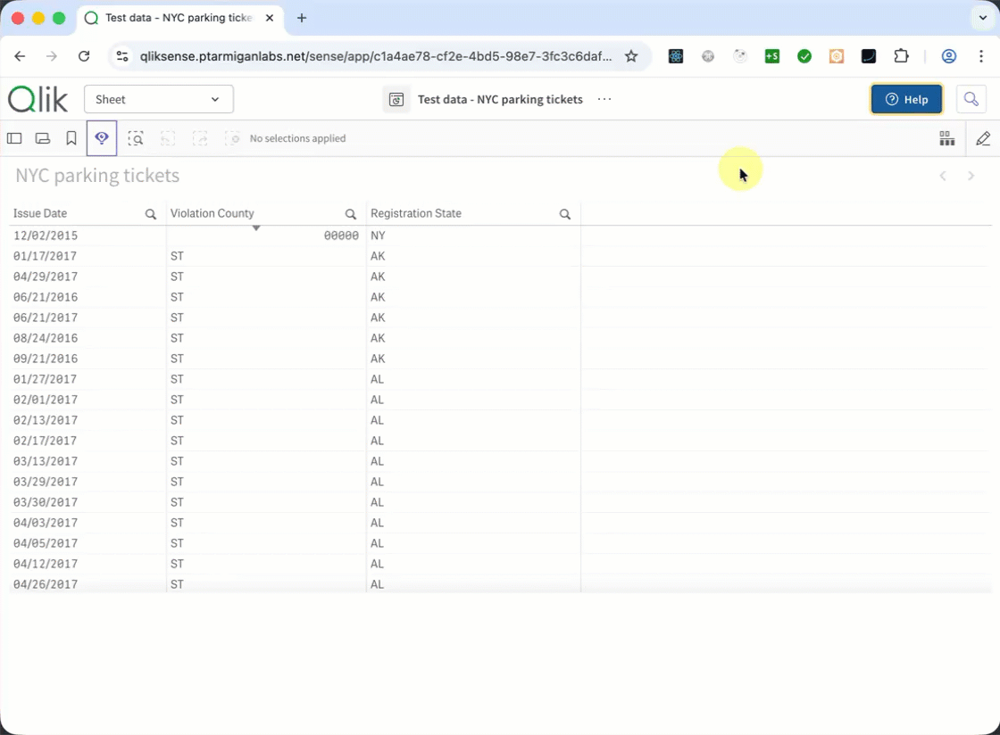
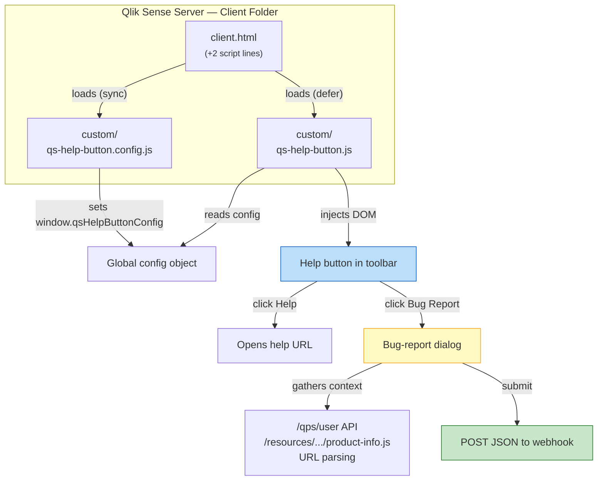
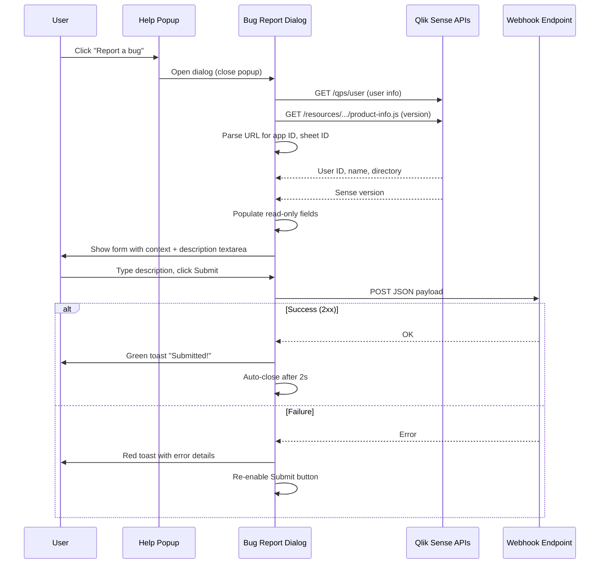

# qs-help-button — Bug Report Variant

A lightweight, self-contained solution that adds a **Help** button with an integrated **Bug Report** dialog to the toolbar of every app in **Qlik Sense Enterprise on Windows** (client-managed).

Clicking the button opens a dropdown popup with:

- **Help** — a configurable link to your organisation's help/documentation page.
- **Report a Bug** — opens a modal dialog pre-populated with Qlik Sense environment context (user ID, user name, Sense version, app ID, sheet ID, URL path). The user adds a free-text description and submits. The report is POSTed as JSON to a configurable webhook endpoint.



---

## Table of Contents

- [qs-help-button — Bug Report Variant](#qs-help-button--bug-report-variant)
  - [Table of Contents](#table-of-contents)
  - [Features](#features)
  - [Quick Start](#quick-start)
  - [Installation](#installation)
    - [Prerequisites](#prerequisites)
    - [Step 1 — Copy files to the Sense server](#step-1--copy-files-to-the-sense-server)
    - [Step 2 — Edit client.html](#step-2--edit-clienthtml)
    - [Step 3 — Restart Qlik Sense services](#step-3--restart-qlik-sense-services)
    - [Step 4 — Verify](#step-4--verify)
  - [Configuration](#configuration)
    - [General options](#general-options)
    - [Toolbar button colors](#toolbar-button-colors)
    - [Popup colors](#popup-colors)
    - [Menu items](#menu-items)
    - [Bug Report settings](#bug-report-settings)
    - [Authentication options](#authentication-options)
    - [Context fields](#context-fields)
    - [Dialog style overrides](#dialog-style-overrides)
    - [Available icons](#available-icons)
  - [Webhook Payload](#webhook-payload)
    - [Payload schema](#payload-schema)
    - [Example payload](#example-payload)
    - [Tested webhook targets](#tested-webhook-targets)
  - [Upgrading Qlik Sense](#upgrading-qlik-sense)
  - [How It Works — Technical Deep Dive](#how-it-works--technical-deep-dive)
    - [Architecture overview](#architecture-overview)
    - [Bug-report dialog flow](#bug-report-dialog-flow)
    - [Context gathering](#context-gathering)
    - [File inventory](#file-inventory)
  - [Hard-refresh the browser](#hard-refresh-the-browser)
  - [Troubleshooting](#troubleshooting)
  - [License](#license)

---

## Features

- **Help link + Bug Report dialog** — two actions in one button
- **Auto-populated context** — the bug-report dialog shows the user ID, user name, user directory, Qlik Sense version, app ID, sheet ID, and URL path, all gathered automatically
- **Webhook submission** — bug reports are POSTed as JSON to any configurable endpoint
- **Flexible authentication** — supports no auth, custom HTTP header (e.g., Bearer token), Qlik Sense session passthrough, or arbitrary custom headers
- **Success/error feedback** — a toast notification confirms whether the submission succeeded or failed
- **Single-line deployment** — only one snippet added to the Qlik Sense `client.html`
- **Zero dependencies** — pure vanilla JavaScript, no build step, no frameworks
- **Fully configurable** — button label, popup title, menu items, icons, URLs, dialog title, webhook URL, auth, context fields, and all colors are customisable
- **SPA-aware** — automatically re-injects the button when Qlik Sense navigates between apps or sheets
- **Accessible** — proper ARIA attributes, keyboard navigation (Escape to close), focus management
- **Upgrade-friendly** — all custom code lives in a separate `custom/` directory

---

## Quick Start

```powershell
# 1. Copy the files to your Qlik Sense server
mkdir "C:\Program Files\Qlik\Sense\Client\custom"
copy qs-help-button.js       "C:\Program Files\Qlik\Sense\Client\custom\"
copy qs-help-button.config.js "C:\Program Files\Qlik\Sense\Client\custom\"

# 2. Edit qs-help-button.config.js — set bugReport.webhookUrl to your endpoint
#    See "Configuration" section below.

# 3. Edit client.html — add two <script> lines before </body>
#    See "Installation" section below.

# 4. Hard-refresh your browser (Ctrl+Shift+R / Cmd+Shift+R).
#    If the button does not appear, restart the Qlik Sense services:
Get-Service QlikSense* | Restart-Service
```

---

## Installation

### Prerequisites

| Requirement | Details |
|---|---|
| Qlik Sense Enterprise on Windows | Client-managed deployment (not Qlik Cloud) |
| Server access | Administrator / RDP access to the Qlik Sense server |
| Qlik Sense version | Tested with client-managed Qlik Sense; expected to work with most modern versions |
| Webhook endpoint | A URL that accepts JSON POST requests for bug reports |

### Step 1 — Copy files to the Sense server

Create a `custom` folder **directly inside the `Client` folder** and copy the two JavaScript files into it.

> **Important:** The `Client` folder is served by the Qlik Sense proxy as `/resources`. Files placed at `Client\custom\` become accessible at `/resources/custom/` in the browser. Do **not** create a `resources` subfolder inside `Client`.

```
C:\Program Files\Qlik\Sense\Client\
├── client.html                          ← modified in Step 2
└── custom\                              ← create this folder
    ├── qs-help-button.js                ← main script
    └── qs-help-button.config.js         ← configuration
```

### Step 2 — Edit client.html

Open `C:\Program Files\Qlik\Sense\Client\client.html` and add the following lines **immediately before** the closing `</body>` tag:

```html
<!-- ===== BEGIN: Qlik Sense Help Button (Bug Report Variant) ===== -->
<script src="../resources/custom/qs-help-button.config.js"></script>
<script src="../resources/custom/qs-help-button.js" defer></script>
<!-- ===== END: Qlik Sense Help Button (Bug Report Variant) ===== -->
```

Save the file.

### Step 3 — Restart Qlik Sense services

```powershell
Get-Service QlikSense* | Restart-Service
```

### Step 4 — Verify

1. Open any Qlik Sense app in your browser.
2. **Hard-refresh** the page (Ctrl+Shift+R / Cmd+Shift+R).
3. Click the **Help** button in the toolbar (left of *Ask Insight Advisor*).
4. Click **Help & documentation** — it should open your configured URL.
5. Click **Report a bug** — a dialog should open with pre-populated context fields.
6. Type a description and click **Submit** — verify your webhook receives the JSON payload.

---

## Configuration

All configuration is done in `qs-help-button.config.js`. Edit the file to match your organisation's needs, then refresh the browser.

### General options

| Property | Type | Default | Description |
|---|---|---|---|
| `buttonLabel` | string | `'Help'` | Text displayed on the toolbar button |
| `buttonTooltip` | string | `'Open help menu'` | Native tooltip shown on hover |
| `buttonIcon` | string | `'help'` | Icon for the toolbar button (see [Available icons](#available-icons)) |
| `popupTitle` | string | `'Need assistance?'` | Heading inside the dropdown popup |
| `anchorSelector` | string | `'#top-bar-right-side'` | CSS selector for the toolbar injection point |
| `pollInterval` | number | `500` | Polling interval (ms) while waiting for the toolbar |
| `timeout` | number | `30000` | Max wait time (ms) before giving up |
| `debug` | boolean | `false` | Enable console debug logging |

### Toolbar button colors

The `buttonStyle` object controls the main toolbar button appearance:

| Property | Default | Description |
|---|---|---|
| `backgroundColor` | `'#165a9b'` | Primary background color |
| `backgroundColorHover` | `'#12487c'` | Background on hover |
| `backgroundColorActive` | `'#0e3b65'` | Background on press |
| `textColor` | `'#ffffff'` | Text and icon color |
| `borderColor` | `'#0e3b65'` | Border color |
| `borderRadius` | `'4px'` | Corner roundness |
| `focusOutlineColor` | `'rgba(255, 204, 51, 0.6)'` | Focus ring color |

### Popup colors

The `popupStyle` object controls the dropdown popup:

| Property | Default | Description |
|---|---|---|
| `backgroundColor` | `'#ffffff'` | Popup body background |
| `borderColor` | `'#0c3256'` | Border around the popup |
| `borderRadius` | `'8px'` | Corner roundness |
| `headerBackgroundColor` | `'#0c3256'` | Header strip background |
| `headerTextColor` | `'#ffcc33'` | Header text color |
| `separatorColor` | `'#e0e0e0'` | Line between menu items |
| `shadowColor` | `'rgba(12, 50, 86, 0.25)'` | Drop-shadow color |

### Menu items

Each entry in `menuItems` is either a **link item** or a **bug-report action item**.

**Link item** — navigates to a URL:

```js
{
  label: 'Help & documentation',
  url: 'https://help.example.com',
  icon: 'help',
  target: '_blank',
  iconColor: '#165a9b',
  bgColor: '#f0f6fc',
  bgColorHover: '#dbeafe',
  textColor: '#0c3256',
}
```

**Bug-report action item** — opens the bug-report dialog:

```js
{
  label: 'Report a bug',
  action: 'bugReport',    // <-- This triggers the dialog instead of a URL
  icon: 'bug',
  iconColor: '#b45309',
  bgColor: '#fffbeb',
  bgColorHover: '#fef3c7',
  textColor: '#78350f',
}
```

Set `action: 'bugReport'` on any menu item to make it open the dialog. You can have multiple link items and one bug-report item (or none — the dialog feature is opt-in via the action property).

### Bug Report settings

The `bugReport` object controls the bug-report dialog and webhook submission:

| Property | Type | Default | Description |
|---|---|---|---|
| `dialogTitle` | string | `'Report a Bug'` | Title shown at the top of the dialog |
| `webhookUrl` | string | `''` | **Required.** The URL to POST the bug report to |
| `webhookMethod` | string | `'POST'` | HTTP method for the webhook call |
| `auth` | object | `{ type: 'none' }` | Authentication strategy (see below) |
| `collectFields` | array | `['userId', 'userName', ...]` | Which context fields to collect (see below) |
| `descriptionPlaceholder` | string | `'Describe the issue…'` | Placeholder text for the description field |
| `successMessage` | string | `'Bug report submitted successfully!'` | Toast message on success |
| `errorMessage` | string | `'Failed to submit bug report.'` | Toast message on failure |
| `dialogStyle` | object | *(see below)* | Dialog color/style overrides |

### Authentication options

The `bugReport.auth` object supports four strategies:

| `auth.type` | Additional properties | Description |
|---|---|---|
| `'none'` | *(none)* | No authentication. Only `Content-Type: application/json` is sent. Relies on network-level security. |
| `'header'` | `headerName`, `headerValue` | Sends a single custom header. Example: `headerName: 'Authorization'`, `headerValue: 'Bearer abc123'`. |
| `'sense-session'` | *(none)* | Forwards the Qlik Sense session cookie (`credentials: 'include'`) and adds the `X-Qlik-Xrfkey` CSRF header. Use this when POSTing to Qlik Sense APIs or a webhook behind the Sense proxy. |
| `'custom'` | `customHeaders` | Sends arbitrary headers from the `customHeaders` object. Example: `{ 'Authorization': 'Bearer abc', 'X-Tenant': 'acme' }`. |

**Examples:**

```js
// Bearer token
auth: {
  type: 'header',
  headerName: 'Authorization',
  headerValue: 'Bearer eyJhbGciOiJ...',
},

// Qlik Sense session passthrough
auth: {
  type: 'sense-session',
},

// Multiple custom headers
auth: {
  type: 'custom',
  customHeaders: {
    'Authorization': 'Basic dXNlcjpwYXNz',
    'X-Project-Key': 'MYPROJECT',
  },
},
```

### Context fields

The `bugReport.collectFields` array controls which environment fields are gathered and displayed in the dialog. Available fields:

| Field | Source | Example value |
|---|---|---|
| `'userId'` | Proxy API (`/qps/user`) | `goran` |
| `'userName'` | Proxy API (`/qps/user`) | `Göran Sander` |
| `'userDirectory'` | Proxy API (`/qps/user`) | `LAB` |
| `'senseVersion'` | Product info file | `November 2025 (v14.254.6)` |
| `'appId'` | Parsed from URL path | `4634fbc8-65eb-4aff-a686-34e75326e534` |
| `'sheetId'` | Parsed from URL path | `a1b2c3d4-...` |
| `'urlPath'` | `location.pathname` | `/sense/app/4634fbc8-.../sheet/a1b2c3d4-.../state/analysis` |

Remove fields you don't need or reorder them as desired. The dialog displays them in the order listed.

### Dialog style overrides

The `bugReport.dialogStyle` object overrides the modal dialog colors (rarely needed):

| Property | Default | Description |
|---|---|---|
| `overlayColor` | `'rgba(0, 0, 0, 0.5)'` | Semi-transparent backdrop |
| `backgroundColor` | `'#ffffff'` | Dialog body background |
| `borderColor` | `'#0c3256'` | Dialog border |
| `borderRadius` | `'10px'` | Corner roundness |
| `headerBackgroundColor` | `'#0c3256'` | Dialog header background |
| `headerTextColor` | `'#ffcc33'` | Dialog header text |
| `primaryButtonBg` | `'#165a9b'` | Submit button background |
| `primaryButtonText` | `'#ffffff'` | Submit button text |
| `primaryButtonHoverBg` | `'#12487c'` | Submit button hover background |
| `cancelButtonBg` | `'#e5e7eb'` | Cancel button background |
| `cancelButtonText` | `'#374151'` | Cancel button text |
| `cancelButtonHoverBg` | `'#d1d5db'` | Cancel button hover background |
| `inputBorderColor` | `'#d1d5db'` | Input field border |
| `inputBorderFocusColor` | `'#165a9b'` | Input field focus border |
| `labelColor` | `'#374151'` | Field label text color |
| `shadowColor` | `'rgba(12, 50, 86, 0.3)'` | Dialog drop shadow |

### Available icons

| Key | Description |
|---|---|
| `help` | Question-mark circle (default) |
| `bug` | Exclamation circle |
| `info` | Info circle |
| `mail` | Envelope |
| `link` | Chain link |
| `close` | X mark (used internally for the dialog close button) |
| `send` | Paper plane (used internally for the Submit button) |

---

## Webhook Payload

### Payload schema

When the user submits a bug report, a JSON payload is POSTed to the configured `webhookUrl`:

```json
{
  "timestamp": "2026-02-14T10:30:00.000Z",
  "context": {
    "userId": "string",
    "userName": "string",
    "userDirectory": "string",
    "senseVersion": "string",
    "appId": "string",
    "sheetId": "string",
    "urlPath": "string"
  },
  "description": "string"
}
```

- `timestamp` — ISO 8601 timestamp of when the report was submitted.
- `context` — contains only the fields listed in `collectFields`. If a field is removed from the config, it won't appear in the payload.
- `description` — the user's free-text description of the issue.

### Example payload

```json
{
  "timestamp": "2026-02-14T10:30:45.123Z",
  "context": {
    "userId": "goran",
    "userName": "Göran Sander",
    "userDirectory": "LAB",
    "senseVersion": "November 2025 (v14.254.6)",
    "appId": "4634fbc8-65eb-4aff-a686-34e75326e534",
    "sheetId": "b8f5e231-7c4a-4f89-9a12-3456789abcde",
    "urlPath": "/sense/app/4634fbc8-65eb-4aff-a686-34e75326e534/sheet/b8f5e231-7c4a-4f89-9a12-3456789abcde/state/analysis"
  },
  "description": "The bar chart on this sheet shows incorrect values for Q4 2025. Expected total revenue of $1.2M but the chart shows $800K. This started happening after the last data reload."
}
```

### Tested webhook targets

| Target | Notes |
|---|---|
| Generic REST API | Any endpoint that accepts `Content-Type: application/json` POST requests |
| httpbin.org | Useful for testing — echoes back the request body |
| Microsoft Teams (Incoming Webhook) | You may need to transform the payload format via an intermediate service (e.g., Power Automate, Azure Function) |
| Slack (Incoming Webhook) | Same as Teams — Slack expects a `text` field, so use an intermediary to reshape the payload |
| Jira (REST API v2) | Use `auth.type: 'header'` with a Basic or Bearer token; the payload needs reshaping for Jira's issue format |
| ServiceNow | Use `auth.type: 'header'` with appropriate credentials |
| Custom Node.js / Python service | Full control over payload processing, storage, and notifications |

---

## Upgrading Qlik Sense

When Qlik Sense is upgraded, the installer **may overwrite** `client.html` but will (probably) **not** touch the `custom/` directory.

After an upgrade:

1. **Verify** that `C:\Program Files\Qlik\Sense\Client\custom\` still contains your files.
2. **Re-add** the two `<script>` lines to `client.html`.
3. **Restart** the Qlik Sense services.

---

## How It Works — Technical Deep Dive

### Architecture overview



### Bug-report dialog flow



### Context gathering

Context is gathered **each time the dialog opens** (not cached from a previous session), ensuring the app ID and sheet ID are current after SPA navigation.

| Field | Method | Latency |
|---|---|---|
| App ID, Sheet ID, URL Path | Synchronous URL parsing | ~0 ms |
| User ID, User Name, User Directory | `GET /qps/user?targetUri=...` (no CSRF needed) | ~50–200 ms |
| Sense Version | `GET /resources/autogenerated/product-info.js` (parse AMD module) | ~50–200 ms |

The two async calls run in parallel. If either fails (network error, permissions), the field shows `(unavailable)` and the form still works.

### File inventory

| File | Purpose | Modify after upgrade? |
|---|---|---|
| `qs-help-button.js` | Core script — DOM injection, dialog, webhook submission | No — lives in `custom/` |
| `qs-help-button.config.js` | Configuration — URLs, labels, webhook settings, auth | No — lives in `custom/` |
| `loader-snippet.html` | Reference snippet for what to add to `client.html` | N/A — reference only |
| `client.html` *(Qlik Sense)* | Two `<script>` lines added before `</body>` | **Yes** — re-add after upgrade |

---

## Hard-refresh the browser

Both the Qlik Sense proxy and the browser may cache static files. After making changes:

1. **Hard-refresh** the browser:

   | OS | Browser | Shortcut |
   |---|---|---|
   | Windows / Linux | Chrome, Edge, Firefox | **Ctrl + Shift + R** or **Ctrl + F5** |
   | macOS | Chrome, Edge, Firefox | **Cmd + Shift + R** |
   | macOS | Safari | **Cmd + Option + R** |

2. **Restart the Qlik Sense services** if the hard-refresh doesn't pick up changes:

   ```powershell
   Get-Service QlikSense* | Restart-Service
   ```

3. **Cache-busting** (optional) — append a version parameter:

   ```html
   <script src="../resources/custom/qs-help-button.config.js?v=2"></script>
   ```

---

## Troubleshooting

| Symptom | Likely cause | Fix |
|---|---|---|
| Button doesn't appear | `client.html` not modified, wrong `<script>` path, or services not restarted | Verify the `<script>` lines. Ensure files are in `Client\custom\` (not `Client\resources\custom\`). Restart Qlik Sense services. |
| Bug report dialog shows "(unavailable)" for user fields | Proxy API call failed | Check browser console (F12) with `debug: true`. Verify `/qps/user` is accessible. |
| Bug report dialog shows "(unavailable)" for Sense version | `product-info.js` not found or parse error | Check browser console. Verify `/resources/autogenerated/product-info.js` is accessible. |
| Submit returns an error | Webhook URL misconfigured, auth issue, or endpoint down | Check the `webhookUrl` in config. Verify the endpoint accepts POST with JSON. Check auth settings. Use `https://httpbin.org/post` for testing. |
| CORS error on submit | Webhook endpoint doesn't allow cross-origin requests | Configure CORS headers on the webhook server, or use a same-origin proxy/intermediary. |
| Button appears then disappears | SPA navigation timing | Set `debug: true`, check console logs. |
| Popup opens behind other elements | z-index conflict | The popup uses `z-index: 10000`, the dialog uses `10001`. Increase if needed. |
| Console errors about `qsHelpButtonConfig` | Config file not loaded before main script | Ensure the config `<script>` tag is **before** the main script tag (no `defer`). |

**Debug mode:** Set `debug: true` in `qs-help-button.config.js` and open the browser console (F12). All activity is logged with the `[qs-help-button]` prefix.

---

## License

MIT — see [LICENSE](../../LICENSE) for details.
